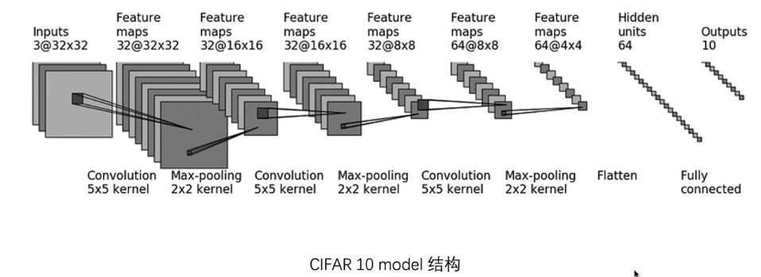

# PyTorch深度学习快速入门教程

## 1）、2）环境安装

pass

## 3）Python学习中的两大法宝函数

1、package（pytorch）：理解为一个工具箱，名字叫pytorch

2、探索这个工具箱，需要用到两个函数：

    dir():打开
    help():说明书作用

* dir(pytorch)>>> 假设输出1，2，3
* dir(pytorch.3)>>>输出a，b，c
* dir(pytorch.3.a)>>>输出具体工具。
  
help()可以查看官方文档。

## 4）Pycharm与Jupyter使用对比

1、python文件

    python文件的块是所有的代码，整体运行的。
    优：通用，传播方便，适用于大型项目
    缺：需要从头运行

2、python控制台

    以任意行为块，运行的
    优：显示每个变量的属性
    缺：不利于代码的阅读及修改

3、Jupyter notebook

    以任意块，运行的
    优：利于代码的阅读即修改
    缺：环境需要配置

## 5）Pytorch加载数据

涉及两个类：

  * Dataset：提供一种方式去获取数据及其label(标签)

  * Dataloader：为后面的网络提供不同的数据形式

1、Dataset：提供一种方式去获取数据及其label(标签)

    实现功能：1、如何获取每一个数据及其label  2、告诉我们总共有多少数据

Dataset类代码实践：

    代码实现了读取蚂蚁数据集和蜜蜂数据集，，并将它们合并为训练集。 (D:\Python项目\Pytorch_learning\read_data.py)


## 6)TensorBoard的使用

    展示图像！！！！！！

1）导入工具：from torch.utils.tensorboard import SummaryWriter

    按住Ctrl+点击SummaryWriter，就可以查看这个类的使用文档

2）主要了解两个函数：(.add_image())、(.add_scalar)

    1、add_scalar():参数：图名称、y轴、x轴   #查看事件绘图

        怎么打开事件文件：
        1）用conda的命令行；
        2）在终端：tensorboard --logdir=事件文件所在的文件夹。
        更改端口号：tensorboard --logdir=事件文件所在文件夹 --port=新端口号。

    2、add_image():参数：名称、图片路径(注意类型)、步数、dataformats="HWC" 这是图片路径的类型的对应高、宽、通道。

        add_image()：方便显示给模型时的训练图片，方便使用。

## 7）Transforms的使用

    主要是用来图像的变换！！！

    from torchvision import transforms

1）transforms结构及用法

    就是个transforms.py的文件（工具箱）。

    流程：输入图片---》工具(比如totensor、resize)---》创建具体的工具tool=transforms.ToTensor()---》使用工具：输入： --》 输出---》输出结果（图片变换）

## 8）常见的Transforms
    Transformas.ToTensor()
    Transformas.Normalize()

    1、ToTensor：将图片转化为张量,,可以作为writer.add_image()的参数展示图片
    2、Normalize：归一化
    3、Resize：等比缩放
    4、Compose：组合流程，比如等比缩放+转化为tensor格式
    5、RandomCrop：随机裁剪

```python
from PIL import Image
from torch.utils.tensorboard import SummaryWriter
from torchvision import transforms

writer=SummaryWriter("logs")
img=Image.open("D:\\Python\\Pytorch_learning\\hymenoptera_data\\train\\ants_image\\0013035.jpg")
print(img)

# ToTensor 将图片转化为Transforms数据类型
trans=transforms.ToTensor()
img_tensor=trans(img)
print(img_tensor)
writer.add_image("To_tensor", img_tensor)

# Normalize 归一化
print(img_tensor[0][0][0])
trans_norm=transforms.Normalize([0.5,0.5,0.5],[0.5,0.5,0.5])
img_norm=trans_norm(img_tensor)
print(img_norm[0][0][0])
writer.add_image("Normalize",img_norm)

#Resize :等比缩放
print(img.size)
trans_resize=transforms.Resize((512,512))
# img PIL ->resize ->img_resize PIL
img_resize=trans_resize(img)
# img_resize PIL ->totensor ->img_resize tensor
img_resize=trans(img_resize)
writer.add_image("Resize",img_resize,0)
print(img_resize)

# Compose ->resize 第二种方法缩放
trans_resize_2=transforms.Resize(512)
# PIL -> PIL ->tensor
# Compose()中的参数需要的是一个列表[数据1，数据2...]，数据需要是transforms类型
# Compose（）相当于一个合并功能，按照写的列表去执行流程
trans_compose=transforms.Compose([trans_resize_2,trans]) # trans_resize_2是缩放图片
img_resize_2=trans_compose(img) #转化为tensor格式
writer.add_image("Resize",img_resize_2,1)

# RandomCrop 随机裁剪
trans_random=transforms.RandomCrop((500,1000))
trans_compose_2=transforms.Compose([trans_random,trans])
for i in range(10):
    img_corp=trans_compose_2(img)
    writer.add_image("RandomHW",img_corp,i)

writer.close()
```

总结：

    1、关注输入输出类型
    2、多看官方文档
    3、关注方法需要什么参数
    4、不知道返回值的时候，用print(type())查看

## 9）torchvision中的数据集（dataset）

pytorch官网：pytorch.org

1、数据集怎么下载应用的：

    train_set=torchvision.datasets.CIFAR10(root="./dataset", train=True, transform=dataset_transform, download=True)
    test_set=torchvision.datasets.CIFAR10(root="./dataset", train=False, transform=dataset_transform, download=True)

    参数root：是数据集下载存放的路径
    参数train=True是训练集；False是测试集。
    参数download：最好默认设置为True，会自动下载数据集。

```python
import torchvision
from torch.utils.tensorboard import SummaryWriter

dataset_transform=torchvision.transforms.Compose([
    torchvision.transforms.ToTensor()
])
train_set=torchvision.datasets.CIFAR10(root="./dataset", train=True, transform=dataset_transform, download=True)
test_set=torchvision.datasets.CIFAR10(root="./dataset", train=False, transform=dataset_transform, download=True)

# print(test_set[0])
# print(test_set.classes)
#
# img, target=test_set[0]
# print(img)
# print(target)
# print(test_set.classes[target])
# img.show()

write=SummaryWriter("P14")
for i in range(10):
    img, target=test_set[i]
    write.add_image("test_set",img,i)
write.close()
```
## 10）DataLoader使用

    from torch.utils.data import DataLoader

    DataLoader是从数据集中怎么取数据的。

```python
import torchvision
from torch.utils.tensorboard import SummaryWriter
from torch.utils.data import DataLoader

# 准备的测试数据集
test_data=torchvision.datasets.CIFAR10(root="./dataset", train=False, transform=torchvision.transforms.ToTensor())

test_loader=DataLoader(dataset=test_data, batch_size=64, shuffle=True, num_workers=0, drop_last=True)
# DataLoader():dataset=数据集，batch_size=一次抓取的数量,shuffle=每次抓取是否打乱排序数据集true就是打乱，
# num_workers=多进程，默认设置为0，drop_last=是否舍去最后一项除不尽的情况

# 测试集的第一张图片及target
img, target=test_data[0]
print(img.shape)
print(target)

writer=SummaryWriter("dataloader")
for epoch in range(2):
    step=0
    for data in test_loader:
        img, target=data
        writer.add_images("Epoch:{}".format(epoch), img, step)
        step=step+1

writer.close()
```

## 11)神经网络基本骨架（nn.module的使用）

```python
# 神经网络基本骨架
import torch
from torch import nn


class TUdui(nn.Module):
    def __init__(self):
        super().__init__()

    def forward(self, input):
        output = input + 1
        return output
    
tudui = TUdui()
x = torch.tensor(1.0)
output = tudui(x)
print(output)

```

# 12)卷积操作

conv2d的部分参数：

    input – input tensor of shape (minibatch,in_channels,iH,iW)

    weight – filters of shape (out_channels, in_channels/groups,kH,kW)

    stride – the stride of the convolving kernel. Can be a single number or a tuple (sH, sW). Default: 1

    padding – implicit paddings on both sides of the input. Can be a single number or a tuple (padH, padW). Default: 0


```python
import torch
import torch.nn.functional as F

# tensor是张量，TOTensor()是将image转为tensorde函数
input=torch.tensor([[1,2,0,3,1],
                    [0,1,2,3,1],
                    [1,2,1,0,0],
                    [5,2,3,1,1],
                    [2,1,0,1,1]])

kernel=torch.tensor([[1,2,1],
                     [0,1,0],
                     [2,1,0]])

# conv2d的输出参数类型必须有四个参数（通道，通道数，5*5）
input=torch.reshape(input, (1,1,5,5))
kernel=torch.reshape(kernel, (1,1,3,3))

print(input.shape)
print(kernel.shape)

#stride:是卷积走的步幅
output=F.conv2d(input,kernel,stride=1)
print(output)

output2=F.conv2d(input, kernel, stride=2)
print(output2)

# padding:是在input的张量周围进行填充一个像素
output3=F.conv2d(input, kernel,stride=1, padding=1)
print(output3)
```

## 13）卷积层

    torch.nn.Conv2d(in_channels,out_channels,kernel_size,stride=1,padding=0,.....)

                    （输入的通道数，输出的通道数，卷积核大小(整数或元组)，步幅，填充）

    out_channel=1-->一个卷积核
    out_channnel=2-->两个卷积核，，可以与第一个卷积核不一样     


```python
import torch
from torch.utils.data import DataLoader
import torchvision
from torch import nn
from torch.nn import Conv2d
from torch.utils.tensorboard import SummaryWriter

dataset = torchvision.datasets.CIFAR10(root="./dataset", train=False, transform=torchvision.transforms.ToTensor(),
                                       download=True)
dataloader = DataLoader(dataset, batch_size=64)


class Tudui(nn.Module):
    def __init__(self):
        super(Tudui, self).__init__()
        # 定义一个卷积层
        self.conv1 = Conv2d(in_channels=3, out_channels=6, kernel_size=3, stride=1, padding=0)

    def forward(self, x):
        x = self.conv1(x)
        return x


tudui = Tudui()
#print(tudui)
writer=SummaryWriter("./logs")
step=0
for data in dataloader:
    imgs, target=data
    output=tudui(imgs)
    # print(imgs.shape)
    # print(output.shape)
    writer.add_images("input",imgs,step)  # torch.size([64,3,32,32])

    output=torch.reshape(output,(-1,3,30,30))
    #print(output.shape)
    writer.add_images("output",output,step) #torch.size([64,6,30,30])

    step=step+1
writer.close()

```

## 14)最大池化的作用

    from torch.nn import MaxPool2d

    池化默认kernel_size=stride。


有个参数ceil_mode：两个模式

    True:ceil  
    False:Floor
    比如2.31
    Floor模式：向下取整：2  
    Ceil模式：向上取整：3 （保留最大值）

最大池化想保留最大特征，并使数据量减少！！！！加快训练速度。

```python
import torch
import torchvision
from torch import nn
from torch.nn import MaxPool2d
from torch.utils.data import DataLoader
from torch.utils.tensorboard import SummaryWriter

dataset = torchvision.datasets.CIFAR10("./dataset", train=False, download=True,
                                       transform=torchvision.transforms.ToTensor())

dataloader = DataLoader(dataset, batch_size=64)

class Tudui(nn.Module):
    def __init__(self):
        super(Tudui, self).__init__()
        self.maxpool1 = MaxPool2d(kernel_size=3, ceil_mode=False)

    def forward(self, input):
        output = self.maxpool1(input)
        return output

tudui = Tudui()

writer = SummaryWriter("./logs_maxpool")
step = 0

for data in dataloader:
    imgs, targets = data
    writer.add_images("input", imgs, step)
    output = tudui(imgs)
    writer.add_images("output", output, step)
    step = step + 1

writer.close()
```

## 15)非线性激活

    from torch.nn import ReLU, Sigmoid

```python
import torch
import torchvision
from torch import nn
from torch.nn import ReLU, Sigmoid
from torch.utils.data import DataLoader
from torch.utils.tensorboard import SummaryWriter

input = torch.tensor([[1, -0.5],
                       [-1, 3]])

input = torch.reshape(input, (-1, 1, 2, 2))  # batch_size=-1 只要让四个参数的积等于input元素数就行，通道数-1可以帮你自动算好
print(input.shape)

dataset = torchvision.datasets.CIFAR10("./dataset", train=False, download=True,
                                       transform=torchvision.transforms.ToTensor())

dataloader = DataLoader(dataset, batch_size=64)

class Tudui(nn.Module):
    def __init__(self):
        super(Tudui, self).__init__()
        self.relu1 = ReLU()
        self.sigmoid1 = Sigmoid()

    def forward(self, input):
        output = self.sigmoid1(input)
        return output

tudui = Tudui()

writer = SummaryWriter("./logs_relu")
step = 0
for data in dataloader:
    imgs, targets = data
    writer.add_images("input", imgs, global_step=step)
    output = tudui(imgs)
    writer.add_images("output", output, step)
    step += 1

writer.close()
```

# 16) 线性层

```python
import torch
import torchvision
from torch import nn
from torch.nn import Linear
from torch.utils.data import DataLoader

dataset = torchvision.datasets.CIFAR10("./dataset", train=False, transform=torchvision.transforms.ToTensor(),
                                       download=True)

dataloader = DataLoader(dataset, batch_size=64, drop_last=True)

class Tudui(nn.Module):
    def __init__(self):
        super(Tudui, self).__init__()
        self.linear1 = Linear(196608, 10)  # 输出特征为10

    def forward(self, input):
        output = self.linear1(input)
        return output

tudui = Tudui()

for data in dataloader:
    imgs, targets = data
    print(imgs.shape)
    output = torch.flatten(imgs)  # 拉平。就是把多维变成一维的方式
    print(output.shape)
    output = tudui(output)
    print(output.shape)
```


## 17)实例



```python
from torch import nn
from torch.nn import Conv2d, MaxPool2d, Flatten, Linear, Sequential
from torch.utils.tensorboard import SummaryWriter


class Tudui(nn.Module):
    def __init__(self):
        super(Tudui,self).__init__()

        self.model1=Sequential(           # 可以简介代码
            Conv2d(3, 32, 5, padding=2),
            MaxPool2d(2),
            Conv2d(32, 32, 5, padding=2),
            MaxPool2d(2),
            Conv2d(32, 64, 5, padding=2),
            MaxPool2d(2),
            Flatten(),
            Linear(1024, 64),
            Linear(64, 10)
        )
    def forward(self,x):
        x=self.model1(x)
        return x

# 测试网络是否正确
tudui=Tudui()
print(tudui)
input=torch.ones((64,3,32,32))  # 这个ones就是值全为1 的输入，测试的用的。
output=tudui(input)
print(output.shape)

writer=SummaryWriter("./logs_seq")
writer.add_graph(tudui, input)
writer.close()
```


## 18）损失函数与反向传播

1、损失函数作用：

    * 计算实际输出和目标之间的差距
    * 为我们更新输出提供一定的依据（反向传播）

损失函数越小越好


交叉熵：分类问题中常见的损失函数。

```python
import torch
from torch.nn import L1Loss
from torch import nn

inputs = torch.tensor([1, 2, 3], dtype=torch.float32)
targets = torch.tensor([1, 2, 5], dtype=torch.float32)

inputs = torch.reshape(inputs, (1, 1, 1, 3))
targets = torch.reshape(targets, (1, 1, 1, 3))

loss = L1Loss(reduction='sum')   # reduction=sum或者mean ，计算损失函数求和/或平方
result = loss(inputs, targets)

loss_mse = nn.MSELoss()
result_mse = loss_mse(inputs, targets)

print(result)
print(result_mse)


x = torch.tensor([0.1, 0.2, 0.3])
y = torch.tensor([1])
x = torch.reshape(x, (1, 3))  # 3个类别，1就是y的值。取x[1]=0.2的意思
loss_cross = nn.CrossEntropyLoss()
result_cross = loss_cross(x, y)
print(result_cross)
```

2、反向传播

    当我们使用损失函数的时候，损失函数调用.backward() 就是反向传播，就能求出每一个调节的参数
    这个参数对应的一个梯度，有了这个梯度，再根据优化器，对这个参数进行调整，以降低整体的误差。

```python
from torch import nn
from torch.nn import Conv2d, MaxPool2d, Flatten, Linear, Sequential
from torch.utils.tensorboard import SummaryWriter
import torchvision
from torch.utils.data import DataLoader

dataset=torchvision.datasets.CIFAR10("./dataset",train=False,transform=torchvision.transforms.ToTensor(),
                                     download=True)

dataloader=DataLoader(dataset, batch_size=64)


class Tudui(nn.Module):
    def __init__(self):
        super(Tudui,self).__init__()

        self.model1=Sequential(           # 可以简介代码
            Conv2d(3, 32, 5, padding=2),
            MaxPool2d(2),
            Conv2d(32, 32, 5, padding=2),
            MaxPool2d(2),
            Conv2d(32, 64, 5, padding=2),
            MaxPool2d(2),
            Flatten(),
            Linear(1024, 64),
            Linear(64, 10)
        )
    def forward(self,x):
        x=self.model1(x)
        return x

loss=nn.CrossEntropyLoss()

tudui=Tudui()
for data in dataloader:
    imgs,targets=data
    outputs=tudui(imgs)
    # print(outputs)
    # print(targets)
    result_loss=loss(outputs,targets)
    result_loss.backward()  # 是对result_loss进行反向传播

```

## 19)优化器

    代码是从反向传播继续写的！！

```python
from torch import nn
from torch.nn import Conv2d, MaxPool2d, Flatten, Linear, Sequential
from torch.utils.tensorboard import SummaryWriter
import torchvision
from torch.utils.data import DataLoader

dataset=torchvision.datasets.CIFAR10("./dataset",train=False,transform=torchvision.transforms.ToTensor(),
                                     download=True)

dataloader=DataLoader(dataset, batch_size=64)


class Tudui(nn.Module):
    def __init__(self):
        super(Tudui,self).__init__()

        self.model1=Sequential(           # 可以简介代码
            Conv2d(3, 32, 5, padding=2),
            MaxPool2d(2),
            Conv2d(32, 32, 5, padding=2),
            MaxPool2d(2),
            Conv2d(32, 64, 5, padding=2),
            MaxPool2d(2),
            Flatten(),
            Linear(1024, 64),
            Linear(64, 10)
        )
    def forward(self,x):
        x=self.model1(x)
        return x
tudui=Tudui()
loss=nn.CrossEntropyLoss()

optim=torch.optim.SGD(tudui.parameters(),lr=0.01)  # 设置优化器

# tudui=Tudui()
for epoch in range(20):
    running_loss=0.0
    for data in dataloader:
        imgs,targets=data
        outputs=tudui(imgs)
        # print(outputs)
        # print(targets)
        result_loss=loss(outputs,targets)
        optim.zero_grad()   # 先将需要调节的参数对应的梯度都设为0
        result_loss.backward()  # 是对result_loss进行反向传播
        optim.step()   # 对参数进行调优，对参数进行更新，执行完后，会重新跳转执行for循环
        running_loss=running_loss+result_loss
    print(running_loss)
```

## 20）现有模型的使用与修改

```python
import torchvision
from torch import nn

vgg16_false=torchvision.models.vgg16(pretrained=False)
vgg16_true=torchvision.models.vgg16(pretrained=True)

print(vgg16_true)
train_data=torchvision.datasets.CIFAR10("./dataset",train=True,transform=torchvision.transforms.ToTensor(),
                                        download=True)
# 这是对模型结构进行修改！！！
# 本来vgg16模型有1000中输出的
vgg16_true.classifier.add_module('add_linear',nn.Linear(1000,10))  # 利用这个将输出改为10个输出点。 增加一个线性层
print(vgg16_true)

print(vgg16_false)
vgg16_false.classifier[6]=nn.Linear(4096,10)
print(vgg16_false)
```

## 21）网络模型的保存与读取

```python
import torch
import torchvision
from torch import nn

vgg16 = torchvision.models.vgg16(pretrained=False)
# 保存方式1,模型结构+模型参数
torch.save(vgg16, "vgg16_method1.pth")

# 保存方式2，模型参数（官方推荐）
torch.save(vgg16.state_dict(), "vgg16_method2.pth")

# 陷阱
class Tudui(nn.Module):
    def __init__(self):
        super(Tudui, self).__init__()
        self.conv1 = nn.Conv2d(3, 64, kernel_size=3)

    def forward(self, x):
        x = self.conv1(x)
        return x

tudui = Tudui()
torch.save(tudui, "tudui_method1.pth")
```

```python
import torch
from model_save import *
# 方式1-》保存方式1，加载模型
import torchvision
from torch import nn

model = torch.load("vgg16_method1.pth")
# print(model)

# 方式2，加载模型 （官方推荐这种）
vgg16 = torchvision.models.vgg16(pretrained=False)  # 要先新建一个网络结构
vgg16.load_state_dict(torch.load("vgg16_method2.pth"))
# print(vgg16)

# 陷阱1
# class Tudui(nn.Module):
#     def __init__(self):
#         super(Tudui, self).__init__()
#         self.conv1 = nn.Conv2d(3, 64, kernel_size=3)
#
#     def forward(self, x):
#         x = self.conv1(x)
#         return x

model = torch.load('tudui_method1.pth')
print(model)
```

## 22）完整的训练模型套路（以CIFAR10数据集）


    train.py

```python
import torchvision
from torch.utils.tensorboard import SummaryWriter

from model import *
# 准备数据集
from torch import nn
from torch.utils.data import DataLoader

train_data = torchvision.datasets.CIFAR10(root="./dataset", train=True, transform=torchvision.transforms.ToTensor(),
                                          download=True)
test_data = torchvision.datasets.CIFAR10(root="./dataset", train=False, transform=torchvision.transforms.ToTensor(),
                                         download=True)

# length 长度
train_data_size = len(train_data)
test_data_size = len(test_data)
# 如果train_data_size=10, 训练数据集的长度为：10
print("训练数据集的长度为：{}".format(train_data_size))
print("测试数据集的长度为：{}".format(test_data_size))


# 利用 DataLoader 来加载数据集
train_dataloader = DataLoader(train_data, batch_size=64)
test_dataloader = DataLoader(test_data, batch_size=64)

# 创建网络模型
tudui = Tudui()

# 损失函数
loss_fn = nn.CrossEntropyLoss()

# 优化器
# learning_rate = 0.01
# 1e-2=1 x (10)^(-2) = 1 /100 = 0.01
learning_rate = 1e-2
optimizer = torch.optim.SGD(tudui.parameters(), lr=learning_rate)

# 设置训练网络的一些参数
# 记录训练的次数
total_train_step = 0
# 记录测试的次数
total_test_step = 0
# 训练的轮数
epoch = 10

# 添加tensorboard
writer = SummaryWriter("./logs_train")

for i in range(epoch):
    print("-------第 {} 轮训练开始-------".format(i+1))

    # 训练步骤开始
    tudui.train()
    for data in train_dataloader:
        imgs, targets = data
        outputs = tudui(imgs)
        loss = loss_fn(outputs, targets)

        # 优化器优化模型
        optimizer.zero_grad()
        loss.backward()
        optimizer.step()

        total_train_step = total_train_step + 1
        if total_train_step % 100 == 0:
            print("训练次数：{}, Loss: {}".format(total_train_step, loss.item()))
            writer.add_scalar("train_loss", loss.item(), total_train_step)

    # 测试步骤开始
    tudui.eval()
    total_test_loss = 0
    total_accuracy = 0
    with torch.no_grad():          # 让模型中的梯度为0，因为测试不用修改梯度，更不用进行优化
        for data in test_dataloader:
            imgs, targets = data
            outputs = tudui(imgs)
            loss = loss_fn(outputs, targets)
            total_test_loss = total_test_loss + loss.item()
            accuracy = (outputs.argmax(1) == targets).sum()
            total_accuracy = total_accuracy + accuracy

    print("整体测试集上的Loss: {}".format(total_test_loss))
    print("整体测试集上的正确率: {}".format(total_accuracy/test_data_size))
    writer.add_scalar("test_loss", total_test_loss, total_test_step)
    writer.add_scalar("test_accuracy", total_accuracy/test_data_size, total_test_step)
    total_test_step = total_test_step + 1

    torch.save(tudui, "tudui_{}.pth".format(i))
    print("模型已保存")

writer.close()

```

    model.py

```python
import torch
from torch import nn

# 搭建神经网络
class Tudui(nn.Module):
    def __init__(self):
        super(Tudui, self).__init__()
        self.model = nn.Sequential(
            nn.Conv2d(3, 32, 5, 1, 2),
            nn.MaxPool2d(2),
            nn.Conv2d(32, 32, 5, 1, 2),
            nn.MaxPool2d(2),
            nn.Conv2d(32, 64, 5, 1, 2),
            nn.MaxPool2d(2),
            nn.Flatten(),
            nn.Linear(64*4*4, 64),
            nn.Linear(64, 10)
        )

    def forward(self, x):
        x = self.model(x)
        return x


if __name__ == '__main__':
    tudui = Tudui()
    input = torch.ones((64, 3, 32, 32))
    output = tudui(input)
    print(output.shape)
```

## 23）利用GPU训练

方式一：

    在网络模型、数据（输入，标注）、损失函数
    这三个调用.cuda()

```python

import torch
import torchvision
from torch.utils.tensorboard import SummaryWriter

# from model import *
# 准备数据集
from torch import nn
from torch.utils.data import DataLoader
import time

train_data = torchvision.datasets.CIFAR10(root="../dataset", train=True, transform=torchvision.transforms.ToTensor(),
                                          download=True)
test_data = torchvision.datasets.CIFAR10(root="../dataset", train=False, transform=torchvision.transforms.ToTensor(),
                                         download=True)

# length 长度
train_data_size = len(train_data)
test_data_size = len(test_data)
# 如果train_data_size=10, 训练数据集的长度为：10
print("训练数据集的长度为：{}".format(train_data_size))
print("测试数据集的长度为：{}".format(test_data_size))


# 利用 DataLoader 来加载数据集
train_dataloader = DataLoader(train_data, batch_size=64)
test_dataloader = DataLoader(test_data, batch_size=64)

# 创建网络模型
class Tudui(nn.Module):
    def __init__(self):
        super(Tudui, self).__init__()
        self.model = nn.Sequential(
            nn.Conv2d(3, 32, 5, 1, 2),
            nn.MaxPool2d(2),
            nn.Conv2d(32, 32, 5, 1, 2),
            nn.MaxPool2d(2),
            nn.Conv2d(32, 64, 5, 1, 2),
            nn.MaxPool2d(2),
            nn.Flatten(),
            nn.Linear(64*4*4, 64),
            nn.Linear(64, 10)
        )

    def forward(self, x):
        x = self.model(x)
        return x
tudui = Tudui()
if torch.cuda.is_available():
    tudui = tudui.cuda()

# 损失函数
loss_fn = nn.CrossEntropyLoss()
if torch.cuda.is_available():
    loss_fn = loss_fn.cuda()
# 优化器
# learning_rate = 0.01
# 1e-2=1 x (10)^(-2) = 1 /100 = 0.01
learning_rate = 1e-2
optimizer = torch.optim.SGD(tudui.parameters(), lr=learning_rate)

# 设置训练网络的一些参数
# 记录训练的次数
total_train_step = 0
# 记录测试的次数
total_test_step = 0
# 训练的轮数
epoch = 10

# 添加tensorboard
writer = SummaryWriter("../logs_train")
start_time=time.time()
for i in range(epoch):
    print("-------第 {} 轮训练开始-------".format(i+1))

    # 训练步骤开始
    tudui.train()
    for data in train_dataloader:
        imgs, targets = data
        if torch.cuda.is_available():
            imgs = imgs.cuda()
            targets = targets.cuda()
        outputs = tudui(imgs)
        loss = loss_fn(outputs, targets)

        # 优化器优化模型
        optimizer.zero_grad()
        loss.backward()
        optimizer.step()

        total_train_step = total_train_step + 1
        if total_train_step % 100 == 0:
            end_time=time.time()
            print(end_time-start_time)
            print("训练次数：{}, Loss: {}".format(total_train_step, loss.item()))
            writer.add_scalar("train_loss", loss.item(), total_train_step)

    # 测试步骤开始
    tudui.eval()
    total_test_loss = 0
    total_accuracy = 0
    with torch.no_grad():
        for data in test_dataloader:
            imgs, targets = data
            if torch.cuda.is_available():
                imgs = imgs.cuda()
                targets = targets.cuda()
            outputs = tudui(imgs)
            loss = loss_fn(outputs, targets)
            total_test_loss = total_test_loss + loss.item()
            accuracy = (outputs.argmax(1) == targets).sum()
            total_accuracy = total_accuracy + accuracy

    print("整体测试集上的Loss: {}".format(total_test_loss))
    print("整体测试集上的正确率: {}".format(total_accuracy/test_data_size))
    writer.add_scalar("test_loss", total_test_loss, total_test_step)
    writer.add_scalar("test_accuracy", total_accuracy/test_data_size, total_test_step)
    total_test_step = total_test_step + 1

    torch.save(tudui, "tudui_{}.pth".format(i))
    print("模型已保存")

writer.close()

```

方式二：定义一个设备

    device=torch.device("cpu")或者
    device=torch.device("cude:0")

    然后调用.to(device)

## 24）完整的模型验证套路

```python
import torch
import torchvision
from PIL import Image
from torch import nn

image_path = "./imgs/dog2.jpg"
image = Image.open(image_path)
print(image)

# png是四通道，处理RGB三通道外，还有一个透明通道
# 所以调用image=image.convert('RGB')保留通道颜色
# 加上这一步，可以适应png、jpg各种格式的图片
image = image.convert('RGB')
transform = torchvision.transforms.Compose([torchvision.transforms.Resize((32, 32)),
                                            torchvision.transforms.ToTensor()])

image = transform(image)
print(image.shape)

class Tudui(nn.Module):
    def __init__(self):
        super(Tudui, self).__init__()
        self.model = nn.Sequential(
            nn.Conv2d(3, 32, 5, 1, 2),
            nn.MaxPool2d(2),
            nn.Conv2d(32, 32, 5, 1, 2),
            nn.MaxPool2d(2),
            nn.Conv2d(32, 64, 5, 1, 2),
            nn.MaxPool2d(2),
            nn.Flatten(),
            nn.Linear(64*4*4, 64),
            nn.Linear(64, 10)
        )

    def forward(self, x):
        x = self.model(x)
        return x

# GPU训练的模型，用CPU验证要指定映射为map_location=torch.device('cpu')
model = torch.load("tudui_39_gpu.pth",map_location=torch.device('cpu'))  #map_location=torch.device('cpu')
print(model)
image = torch.reshape(image, (1, 3, 32, 32))

model.eval()
with torch.no_grad():
    output = model(image)
print(output)

print(output.argmax(1))  # 最大概率

```
