# **吴恩达 机器学习**

## 1、线性回归

### 1、基本术语
training set=训练集

x="input" variable feature

y="output" variable "target" variable

m=训练样本总数

(x,y)表示一个训练样本

(x^I,y^i)=1^th training example

### 2、监督学习的工作原理和流程
 一元线性回归：
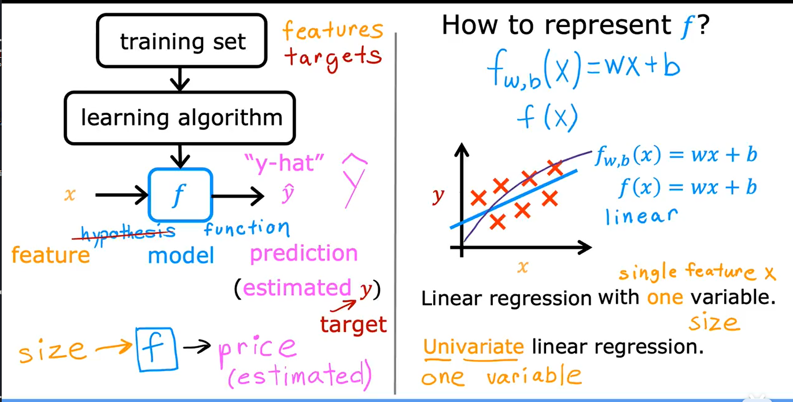

Linear regression:线性回归

Univariate linear regression:一元线性回归

为了训练好一个模型，有件事必须去做，那就是构造一个 **代价(成本)函数**

### 3、代价函数
1）代价函数公式：

(Cost function)代价函数是评价模型的一个指标，有助于我们去优化模型..用来衡量平方差的大小

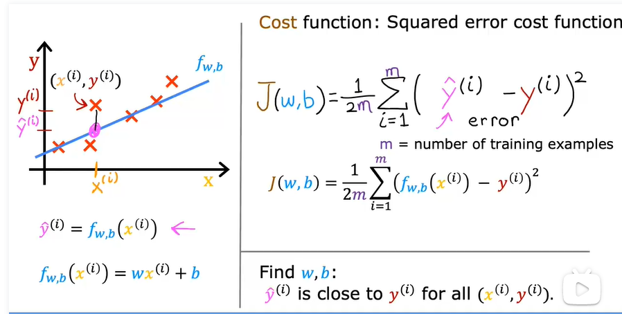

J(w,b):代价函数(方差代价函数)

2）代价函数的直观理解：

 choose w to minimize J(w)。(这是只有一个参数w的情况下)

 大多数时候不止w，还有b，，需要找到对应的w和b值去最小化J。

**所以，线性回归的目标就是找到参数w或w和b，使的代价函数的值最小**

3）可视化的代价函数

将三维碗形曲面图可视化为等高图

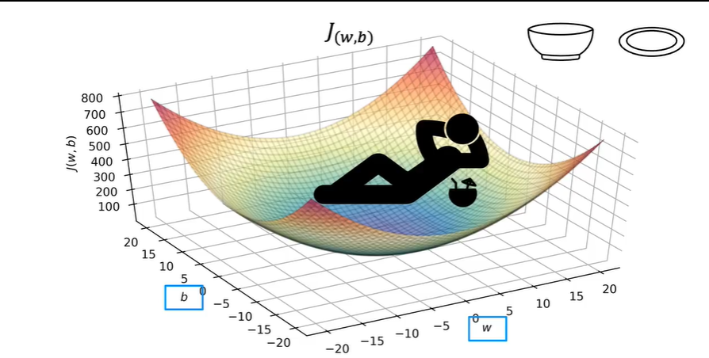

横坐标：w，纵坐标：b，函数值：J(w,b)

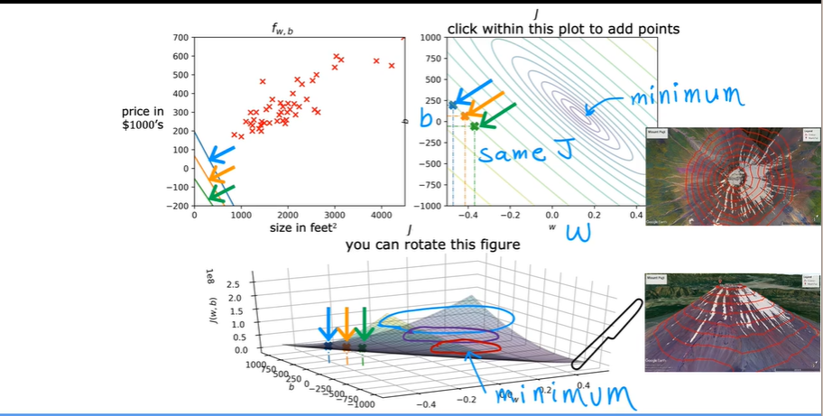

将三维碗形曲面图可视化为等高图. (最小椭圆代表最佳的(w,b)，使得J最小)

通过这种可视化，就能看到不同选择(w,b)是如何影响拟合数据的直线的.

### 4、梯度下降
1）不断找到局部下降最快的路径，不断重复该过程，直到到达局部最小值的地方

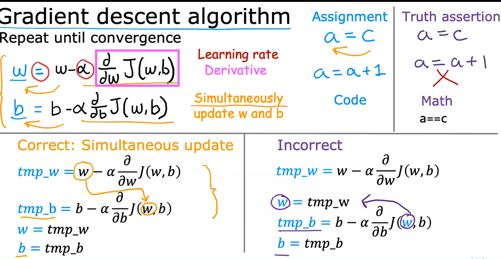

Simultaneously update:同时更新

    公式中的α：被称为学习率(learning rate)，学习率通常是个小正数，在0-1之间，α的作用它基本控制了你向下走的每一步步幅，如果α很大，导致一个非常激进的梯度下降过程，也就是你下降的步子会迈的很大，如果α很小，你就是一点点的往下走。 后面会学习如何选择一个好的学习率。

梯度下降是同时更新w，b值。

2）导数项的直观理解

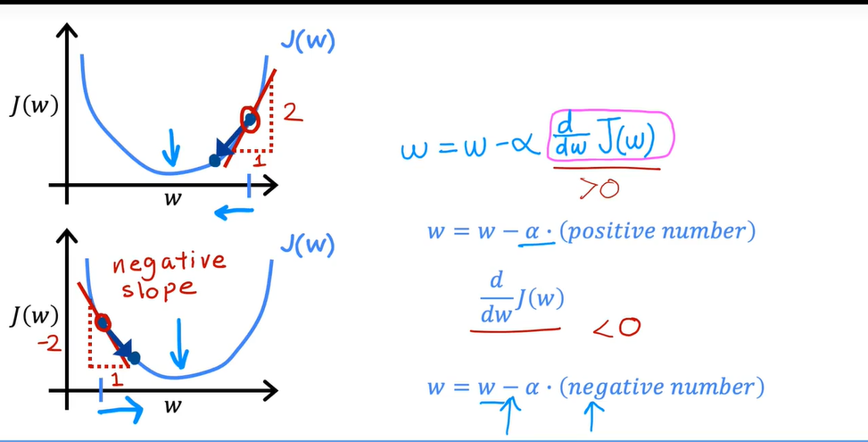

这里是讨论了w，让b=0

3）线性回归的梯度下降

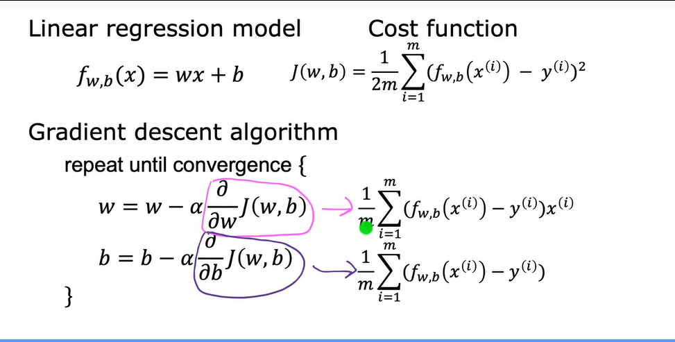

梯度下降原理：它可以导向局部最小值而不是全局最小值，全局最小值意味着在所有可能的J点中，它总是收敛于全局最小值。  

但是在线性回归中使用误差平方代价函数的时候，代价函数永远不会有多个局部最小值，只有一个全局最小值，因为代价函数是碗状的（凸函数）如上图。。所以对一个凸函数进行梯度下降的时候，有一个很好地特性，只要你学习率选择得当，它总是收敛于全局最小值。

4）批量梯度下降

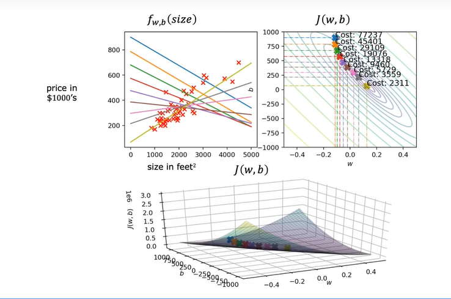

这种梯度下降过程称为：
"Batch" gradient descent:**批量梯度下降**

批量梯度下降指每一步梯度下降，都会考虑到所有的训练样本而不是训练数据的子集。 

当然，也有其他梯度下降并不会看整个数据集，他们在每个更新步骤中查看小一点的训练数据子集。

## 2、多变量回归
### 1）多元特征

引入一些新符号：变量x1,x2,x3,x4来表示四个特征

X下标j，表示特征列表；

n表示特征的总数   例子中n=4；

X的上标，表示第i个训练样本；
例：x^(2)表示第二个训练样本的特征向量，也就是[1416,3,2,40]

x3^(2):表示第二个训练样本，第三个特征（j=3，下标）

下图：
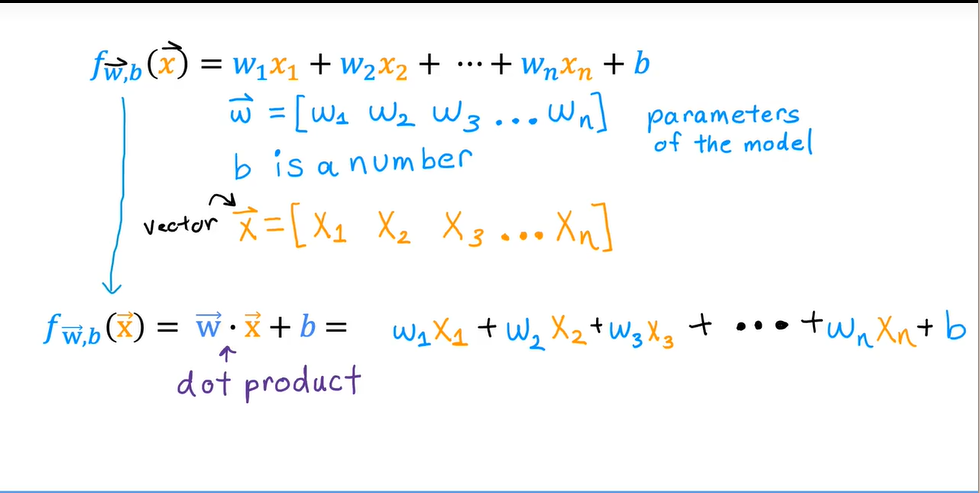

    f w,b(x)=w1*x1+w2*x2+....+wn*xn+b

    w(->向量)=[w1 w2 w3 ....wn]

    x(->向量)=[x1 x2 x3 ... x4]

    dot product:点积

### 2）向量化

NumPy:一个库

Python数组下标从零开始

range(0,n)->表示0--(n-1)

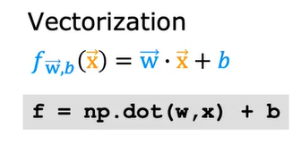

np.dot(w,x)实现了向量w和x之间的点积。

NumPy的dot函数，是两个向量点乘运算的向量化实现。

**向量化的两个好处：1、减少了代码量；2、比不用向量化的算法运算更快（原因是dot函数能够调用计算机中并行的硬件，Cpu、Gpu）**

### 3）多元线性回归的梯度下降

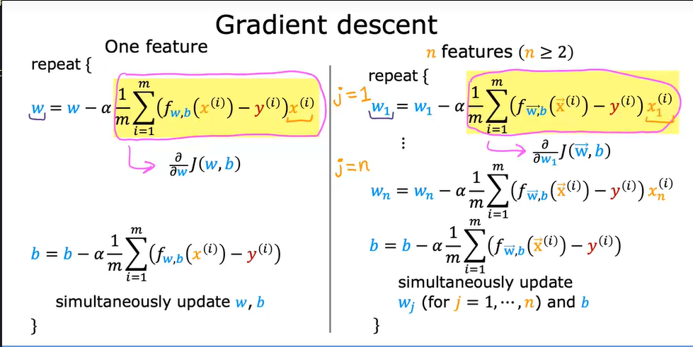

其他算法：正规方程：求解w,b(了解)。

### 4）特征放缩(Feature scaling)

它能让梯度下降运行得更快。

总结：当你有不同的特征且取值范围差异较大，它可能会导致梯度下降运行缓慢，但通过重新放缩这些特征，使它们都具有可比较的值范围，可显著加快梯度下降速度。

具体怎么做的呢？？？？？ ↓↓↓

方法一：

例：300<=x1<=2000;
用x1除以max

即：0.15<=x1<=1

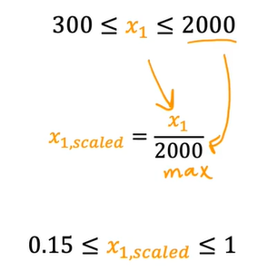

法二：

均值归一化：重新缩放特征值，使得特征都以0为中心，通常在-1到1之间。

首先要找到平均值，也叫x1在训练集上的均值(希腊字母μ)
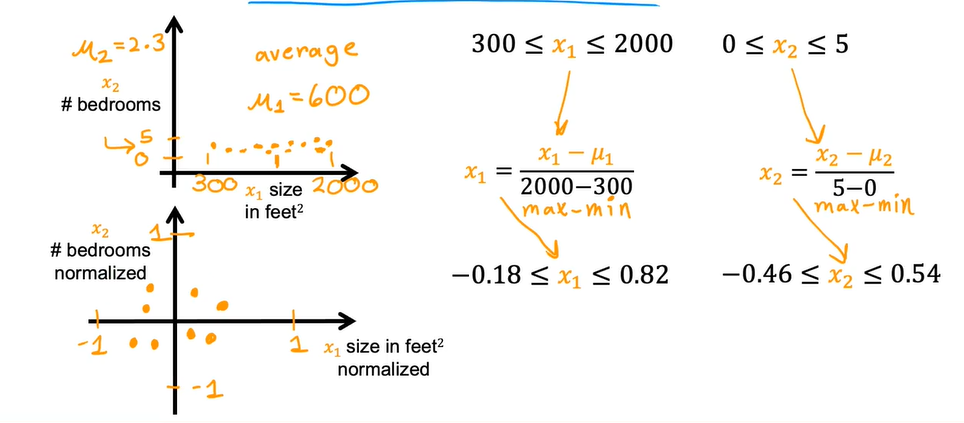

法三：

Z-score标准化（Z-score归一化/规范化）

（希腊字母σ：标准差）
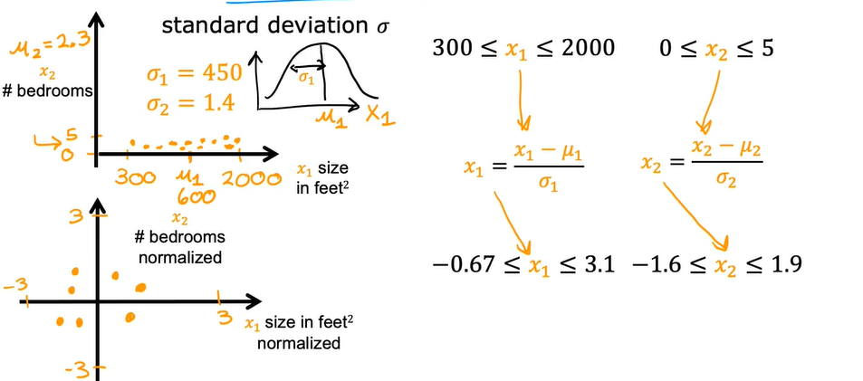.

以上。

在进行特征缩放时，最好把目标定为将每个特征的取值范围定在-1~1附近。。不要太大也不要太小。
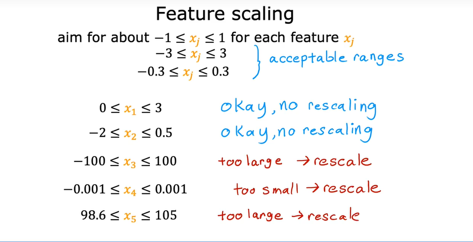

### 5)检查梯度下降是否收敛

学习曲线：横轴代表梯度下降的迭代次数，纵轴代表成本J。

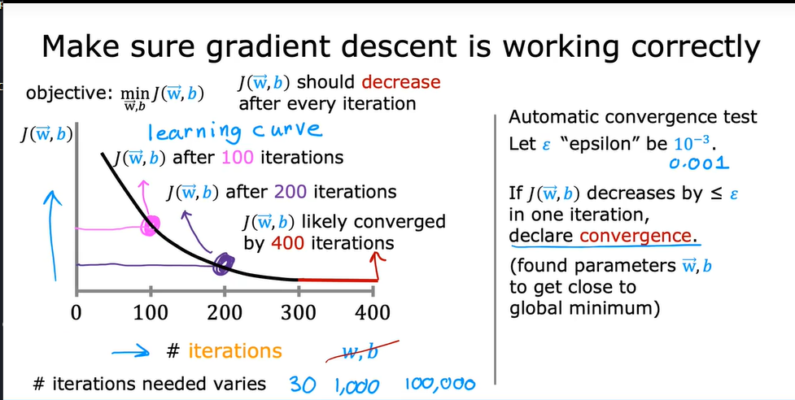

上图中迭代次数到400次时，曲线已经变平，意味着梯度下降以及收敛，因为曲线不再下降了。

一般我们很难先知道迭代几次就收敛，所以可以先画个**学习曲线**，看看需要迭代多少次之后停止模型训练。

图右：使用自动收敛测试方法：

用ζ表示一个小数字的变量，如0.001，如果代价J迭代中减少的量小于这个数，可以看到曲线的最右边这部分是平坦的，可以说是收敛的。

记住：收敛就是指你找到了参数w和b接近J的最小可能值的情况。

选出正确的ζ是相当困难的，主要还是依赖于左边的图。

### **6)学习率的选择**

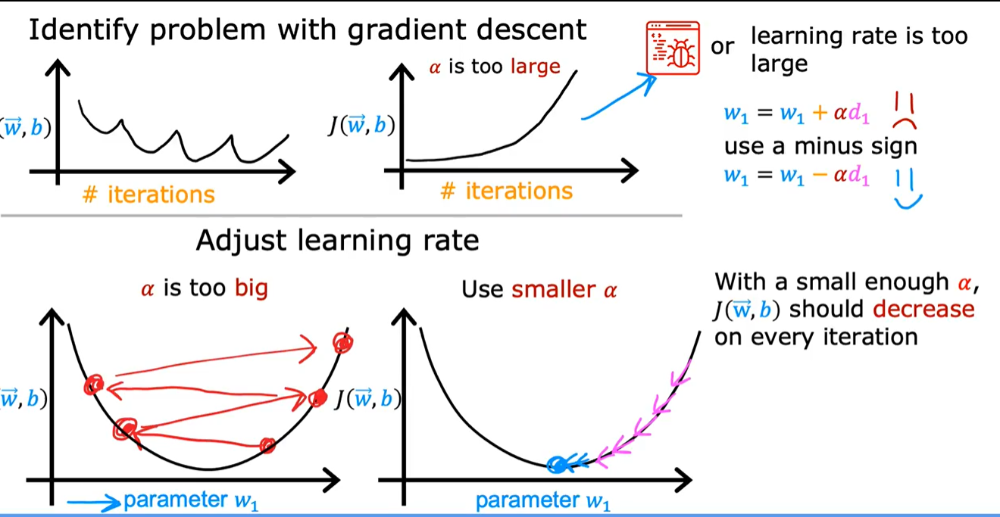

绘制代价-迭代次数图，注意到J有时上升有时下降，说明梯度下降工作不正常，可能意味着代码中有bug或学习率太大导致的。

上右图代价J一直变大，可能就是有bug。

正确实现梯度下降的一个调试技巧：在学习率足够小的情况下，每迭代一次，代价函数都应该减小。所以如果代价函数下降的不正常，可以将α设为一个很小很小的数字，看看是否每次迭代的代价都降低，如果即使α是一个很小的数，J不会每次迭代减小，反而增加，一般是代码有bug。

**尝试不同的一系列α值：**

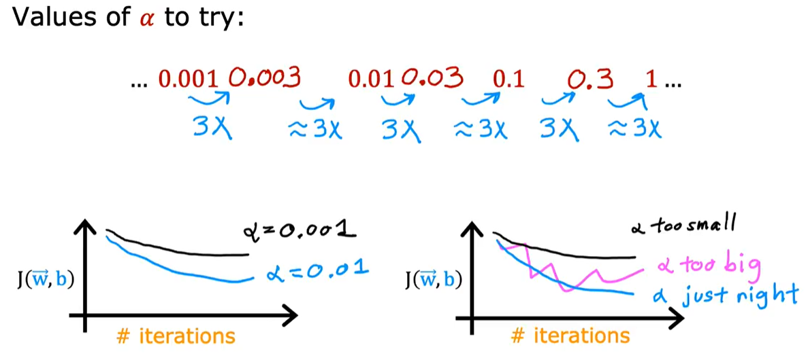

0.001  
0.01  
0.1  
1
少量迭代，绘制代价函数J；

试了0.001后,可以将各学习率提升三倍，每次选取是前一个值的三倍，做的就是尝试一系列α值，直到找的α值太小，且确保（代价下降太慢）；找到一个太大的α值(代价反复横跳);

然后我会慢慢选择最大的合适的学习率,(代价下降不慢、不横跳)或则比我找到的最大合理值稍微小一点，一般这么做，会选到一个合适的学习率。

### 7）特征工程

在许多实际应用中，选择或者输入合适的特征才是让算法正常工作的关键步骤。

**在特征工程中，运用你的知识或者直觉去设计新的特征，通常通过变换或合并问题的原始特征，使其帮助算法更简单的做出准确的预测，，这取决于你对实际应用的见解，而不是直接使用最开始有的特征，有时通过设计一个新特征，可能会得到一个更好的模型。**

例如：房子的长、宽，这是两个特征，设计出房子面积这一新的特征，能够更好匹配模型。

### 8）多项式回归

结合多元线性回归和特征工程的概念，提出多项式回归的新算法，将帮助我们将数据拟合成曲线、非线性函数。

例如：x，x^2,x^3

f=w1*x+w2*x^2+w3*x^3+b:选择这样的特征，那么特征的放缩会变得很重要，要放缩成可比较的值的范围。

### 9）

    Scikit-learn是一个非常广泛使用的开原机器学习库。

## 3、分类(Classification)

二分类问题：0 or 1

一对术语：正样本(true/one)和负样本(false/zero)
正负样本不意味着样本的好坏，只是说明是否、0/1的概念。

### 1)逻辑回归

逻辑回归的结果是拟合一条S型曲线去拟合数据

逻辑回归模型和公式：
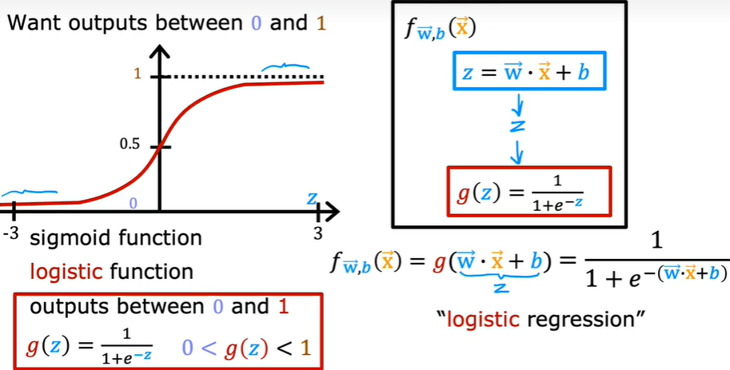

上图是：sigmoid函数图像，0<g(z)<1

z=w*x+b,有这个求出z值，再带入到sigmoid函数，得到输出值(预测值)g(z).

### 2)边界决策(Decision boundary)

z=w*x+b=0:决策边界

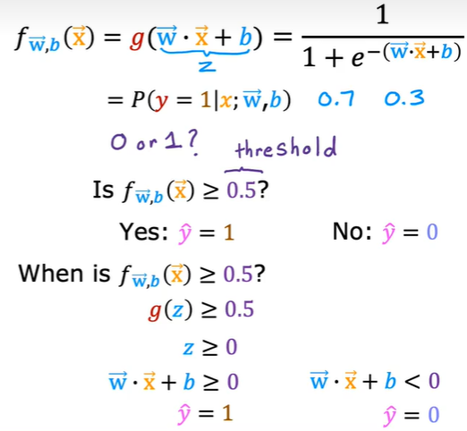

根据sigmoid函数图像：
        当f(x)>=0.5? 是：y=1; 否：y=0 （y是预测值)

        即,当f(x)>=0.5--->g(z)>=0.5--->z>=0--->

        是：w*x+b>=0--->y=1

        否：w*x+b<0--->y=0

### 3)逻辑回归的代价函数

如何选择参数w和b？

事实证明，对于逻辑回归，平方误差模型函数并不是一个好的选择。

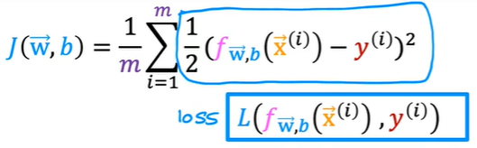

相比于线性回归的代价函数，唯一改变就是把1/2放在了求和公式里面，而不是外面。

这里稍微改变一下代价函数J(w,b)的定义：把下边(loss)的式子，叫做**单个训练例子的损失**。大写L表示**损失函数**，它是关于f(x)和真实标签y的函数

下图就是逻辑回归 中用到的**损失函数**的定义(提出的关于逻辑回归损失函数的新定义)

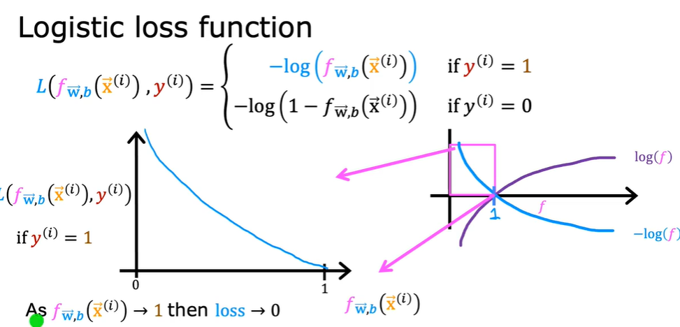

上图：(横坐标：预测值，纵坐标：损失值)

    y=1时：如果算法预测概论接近于1，而真实y是1，那么损失非常小，几乎是0，因为很接近正确答案了

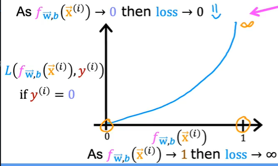

    y=0时：当f=0或非常接近0时，损失会非常小，这意味着预测的和真实值很接近。f值越大，损失越大，因为预测距离真实值越远。

### 4)逻辑回归的简化代价函数

注意：y取值：0或1

下图：简化的损失函数，当y取不同值时，就是原来的函数
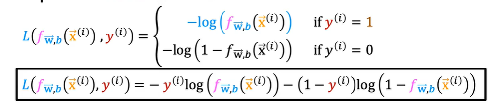

将简化的损失函数带入代价函数J(w,b),得到最终的代价函数。↓
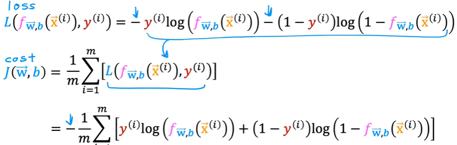

### 5)逻辑回归的梯度下降

    重点就是如何找到最佳的参数w和b！！

    计算w、b的值，必须先算出图右的偏导数值，再代入到左边求w、b公式中，，注意，这些数据都是同步更新的。
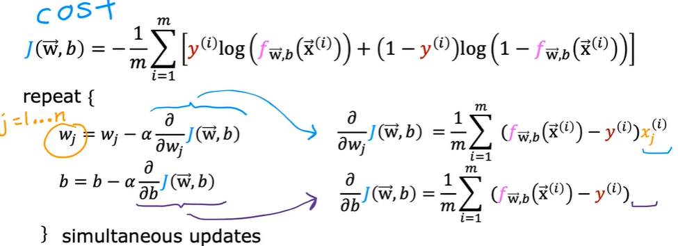

    逻辑回归的梯度下降与线性回归的梯度下降，不同的是对f(x)的定义↓↓
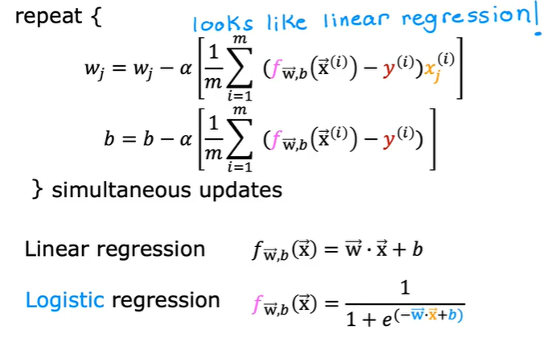

### 6)过拟合、欠拟合

欠拟合：就是算法不能很好拟合训练数据，也就是模型对训练数据拟合不足----》算法有高偏差(high bias)

"泛化":算法能够适用于除训练集之外的样本。(意味着对没见过的样本也能做出好的预测)

过拟合：模型对训练集过于精准的拟合了，但是不具有泛化能力。(模型过拟合了数据)----》算法具有高方差(high variance)

    机器学习的目标就是找到一个既不欠拟合也不过拟合的模型！！

### 7)解决过拟合问题

方法一：收集更多的训练数据，是解决过拟合的首要工具。

方法二：观察是否可以使用更少的特征，(减少多项式)

方法三：正则化

    正则化做的是尽可能地让算法缩小参数的值，不一定要求把参数变成0
    正则化作用是，让你保留所有的特征，但防止特征权重过大，这有时会导致过拟合。

    按照惯例，只需要减小参数W的大小，参数b影响不大。

### 8)带有正则化的代价函数

正则化的思想就是，参数越小，模型可能会简单，也许是因为一个模型的特征变少了，那么过拟合的可能性也变小了

(普遍)实现正则化的方式是：惩罚所有的特征，准确说是惩罚所有的w参数

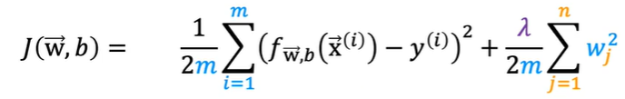
λ/2*m   ：lambda希腊字母。(它是正则化参数)
λ的理想选择是，能够平衡第一项和第二项：最小化均方误差和保持参数w较小

    上图公式：最小化第一项，可以让算法更好的拟合数据；最小化第二项，让参数w尽可能的小，减小过拟合的风险。

### 9)正则化线性回归实现梯度下降

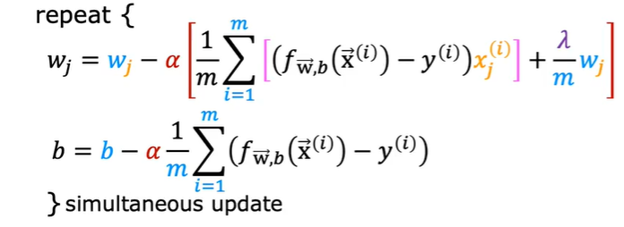

正则化逻辑回归：

在最小化逻辑回归的代价函数时，会惩罚参数w1，w2到wn，防止它们过大

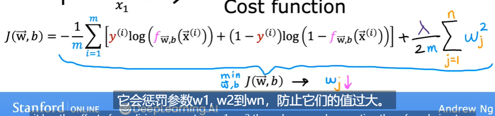

正则化逻辑回归实现梯度下降：

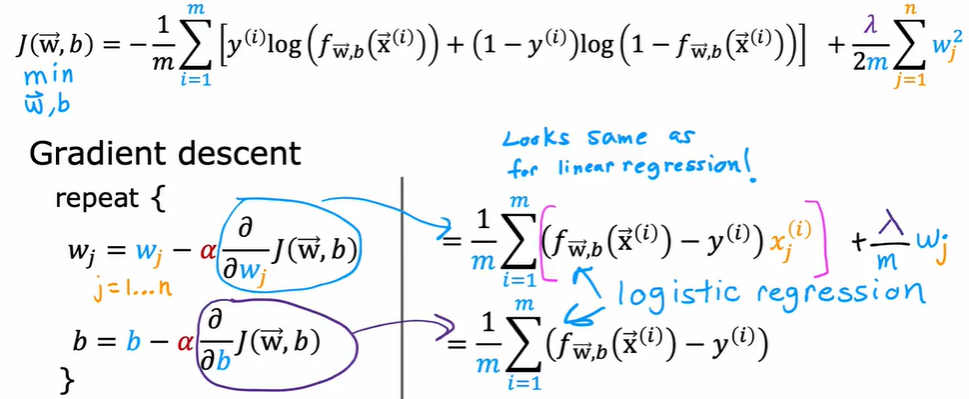

    正则化逻辑回归梯度下降公式与正则化线性回归的梯度下降公式一样，就是对f函数的定义不同！！！！

# 神经网络(也称深度学习算法)

## 1、神经网络与直觉

### 1）神经元和大脑

    pass

### 2）需求预测

    输入层(输入向量X)、输出层、中间层叫做隐藏层。

    神经网络一个很好地特点是，当你从数据中训练它时，不需要明确的决定其他什么特征，神经网络可以自己计算出它想要在这个隐藏层中使用的特征。

## 2、神经网络模型

### 1）神经网络层(Neural network layer)

    层级，我们用上标[]来表示第几层的参数和层级。

    神经网络的工作原理：每一层输入一个数字向量，应用一堆逻辑回归单元，然后计算另一个向量，然后一层接着一层，直到你得到最终的输出层计算(就是神经网络的预测)，然后设置阈值或不做最终的预测。

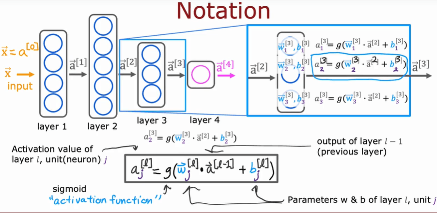

上图主要用来理解符号、上标、下标的意思：

    输入层通常是第0层，这里隐藏层有3层，第四层是输出层，所以这个神经网络一共有4层。

    看图上下面手写的式子:
    
        a表示激活值，上标L是指第L层的激活值,下标j表示第j个神经元，a[l-1]表示上一层的激活值。

        这里的g是sigmoid函数，在神经网络中g还称为激活函数。
        激活函数就是能够输出这些激活值的函数。

        输入向量x，它的另一个名字是a_0,这样方程也适用于第一层(l=0)

        这些就能够计算任意一层的激活值。

### 3）前向传播预测

    pass、(上课老师讲过)

## 3、TensorFlow框架

    TensorFlow是实现深度学习算法的主流框架之一。

    numpy是线性代数和Python的标准库。

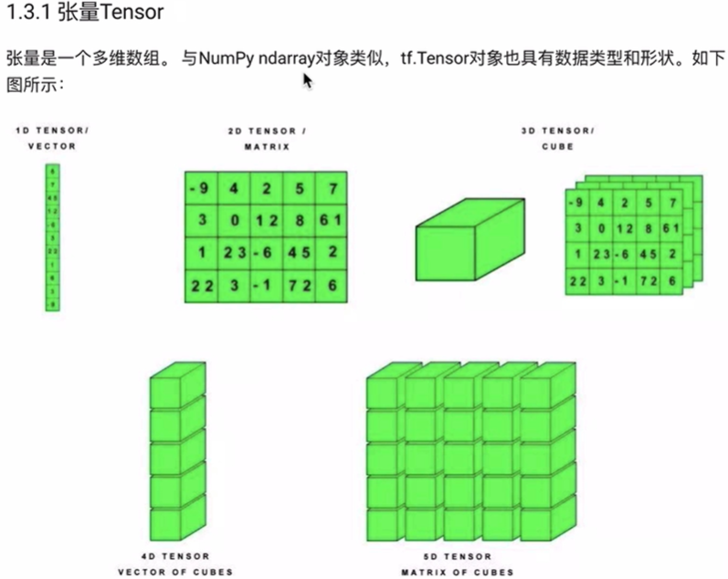
    张量(Tensor)就是一个多维数组,比如：一维数组：一维张量；；二维数组：二维张量(矩阵)....

### 1）数据在TensorFlow和Numpy中表示

    TensorFlow与Numpy表示矩阵有小小的差别：

    Numpy是如何存储向量和矩阵的：

        x=np.array([[2000.0,17.0]]):两个[],表示矩阵
        比如：x=np.array([[1,2,3],[4,5,6]]):表示2*3的矩阵

        比如：x=np.array([200,17]):一个[],表示一维向量
    
    TensorFlow表示矩阵：
        a1=layer_1(x),这里a1假设为[[0.2,0.7,0.3]]-->1*3的矩阵

        而TF表示为：
        tf.Tensor([[0.2 0.7 0.3]],shape=(1,3),dtype=float32)->shape()表示1*3的矩阵，dtype=float表示浮点型。

    如果你想将一个张量a1，转换回Numpy数组，可以使用函数a1.numpy(),它会获取相同的数据并以Numpy数组形式返回，而不会是TensorFlow数组或TensorFlow矩阵的形式。

### 2)构建一个神经网络

    之前：
        x=np.array([[200.0,17.0]])
        layer_1=Dense(units=3,activation="sigmoid")
        a1=layer_1(x)

        layer_2=Dense(units=1,activation="sigmoid")
        a2=layer_2(a1)
    
    每次计算一层。

    TensorFlow另一种方法：
        layer_1=Dense(units=3,activation="sigmoid")
        layer_2=Dense(units=1,activation="sigmoid")
        model=Sequential([layer_1,layer_2])

        x=np.array([[200.0,17.0],
                    [120.0,5.0],
                    [425.0,20.0],
                    [212.0,18.0]])
        y=np.array([1,0,0,1])
        model.compile(...)  #后面会讲
        model.fit(x,y)      #后面会讲

        model.predict(x_new)
    这里不用手动获取数据并传递给第一层，然后从第一层和第二层获取激活值。。Tf的顺序函数Sequential，能够将第一层和第二层串联起来形成一个神经网络。
    x输入数据、y是目标值。。units=3有3个单元的密集层。

    按照惯例。我们不指定层一、层二，而是直接放到顺序函数中，如下：

        model=Sequential([
            Dense(units=3,activation="sigmoid"),
            Dense(units=1,activation="sigmoid")])

## 4、实践神经网络

