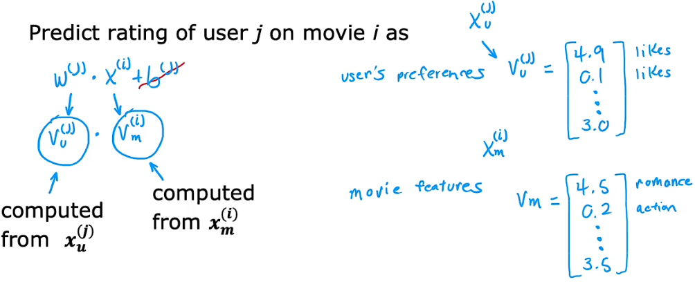
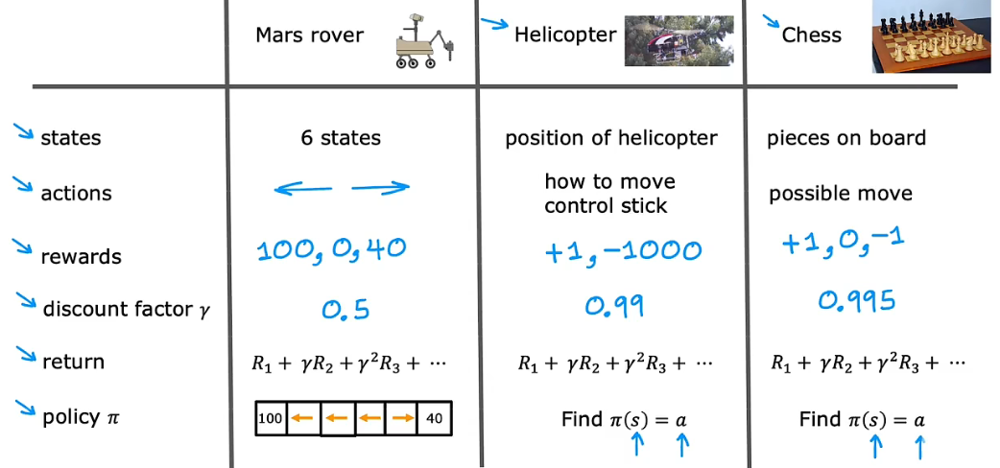

# **吴恩达 机器学习**

## 1、线性回归

### 1、基本术语
training set=训练集

x="input" variable feature

y="output" variable "target" variable

m=训练样本总数

(x,y)表示一个训练样本

(x^I,y^i)=1^th training example

### 2、监督学习的工作原理和流程
 一元线性回归：

Linear regression:线性回归

Univariate linear regression:一元线性回归

为了训练好一个模型，有件事必须去做，那就是构造一个 **代价(成本)函数**

### 3、代价函数
1）代价函数公式：

(Cost function)代价函数是评价模型的一个指标，有助于我们去优化模型..用来衡量平方差的大小

J(w,b):代价函数(方差代价函数)

2）代价函数的直观理解：

 choose w to minimize J(w)。(这是只有一个参数w的情况下)

 大多数时候不止w，还有b，，需要找到对应的w和b值去最小化J。

**所以，线性回归的目标就是找到参数w或w和b，使的代价函数的值最小**

3）可视化的代价函数

将三维碗形曲面图可视化为等高图

横坐标：w，纵坐标：b，函数值：J(w,b)

将三维碗形曲面图可视化为等高图. (最小椭圆代表最佳的(w,b)，使得J最小)

通过这种可视化，就能看到不同选择(w,b)是如何影响拟合数据的直线的.

### 4、梯度下降
1）不断找到局部下降最快的路径，不断重复该过程，直到到达局部最小值的地方

Simultaneously update:同时更新

    公式中的α：被称为学习率(learning rate)，学习率通常是个小正数，在0-1之间，α的作用它基本控制了你向下走的每一步步幅，如果α很大，导致一个非常激进的梯度下降过程，也就是你下降的步子会迈的很大，如果α很小，你就是一点点的往下走。 后面会学习如何选择一个好的学习率。

梯度下降是同时更新w，b值。

2）导数项的直观理解

这里是讨论了w，让b=0

3）线性回归的梯度下降

梯度下降原理：它可以导向局部最小值而不是全局最小值，全局最小值意味着在所有可能的J点中，它总是收敛于全局最小值。  

但是在线性回归中使用误差平方代价函数的时候，代价函数永远不会有多个局部最小值，只有一个全局最小值，因为代价函数是碗状的（凸函数）如上图。。所以对一个凸函数进行梯度下降的时候，有一个很好地特性，只要你学习率选择得当，它总是收敛于全局最小值。

4）批量梯度下降

这种梯度下降过程称为：
"Batch" gradient descent:**批量梯度下降**

批量梯度下降指每一步梯度下降，都会考虑到所有的训练样本而不是训练数据的子集。 

当然，也有其他梯度下降并不会看整个数据集，他们在每个更新步骤中查看小一点的训练数据子集。

## 2、多变量回归
### 1）多元特征

引入一些新符号：变量x1,x2,x3,x4来表示四个特征

X下标j，表示特征列表；

n表示特征的总数   例子中n=4；

X的上标，表示第i个训练样本；
例：x^(2)表示第二个训练样本的特征向量，也就是[1416,3,2,40]

x3^(2):表示第二个训练样本，第三个特征（j=3，下标）

下图：

    f w,b(x)=w1*x1+w2*x2+....+wn*xn+b

    w(->向量)=[w1 w2 w3 ....wn]

    x(->向量)=[x1 x2 x3 ... x4]

    dot product:点积

### 2）向量化

NumPy:一个库

Python数组下标从零开始

range(0,n)->表示0--(n-1)

np.dot(w,x)实现了向量w和x之间的点积。

NumPy的dot函数，是两个向量点乘运算的向量化实现。

**向量化的两个好处：1、减少了代码量；2、比不用向量化的算法运算更快（原因是dot函数能够调用计算机中并行的硬件，Cpu、Gpu）**

### 3）多元线性回归的梯度下降

其他算法：正规方程：求解w,b(了解)。

### 4）特征放缩(Feature scaling)

它能让梯度下降运行得更快。

总结：当你有不同的特征且取值范围差异较大，它可能会导致梯度下降运行缓慢，但通过重新放缩这些特征，使它们都具有可比较的值范围，可显著加快梯度下降速度。

具体怎么做的呢？？？？？ ↓↓↓

方法一：

例：300<=x1<=2000;
用x1除以max

即：0.15<=x1<=1

法二：

均值归一化：重新缩放特征值，使得特征都以0为中心，通常在-1到1之间。

首先要找到平均值，也叫x1在训练集上的均值(希腊字母μ)

法三：

Z-score标准化（Z-score归一化/规范化）

（希腊字母σ：标准差）
.

以上。

在进行特征缩放时，最好把目标定为将每个特征的取值范围定在-1~1附近。。不要太大也不要太小。

### 5)检查梯度下降是否收敛

学习曲线：横轴代表梯度下降的迭代次数，纵轴代表成本J。

上图中迭代次数到400次时，曲线已经变平，意味着梯度下降以及收敛，因为曲线不再下降了。

一般我们很难先知道迭代几次就收敛，所以可以先画个**学习曲线**，看看需要迭代多少次之后停止模型训练。

图右：使用自动收敛测试方法：

用ζ表示一个小数字的变量，如0.001，如果代价J迭代中减少的量小于这个数，可以看到曲线的最右边这部分是平坦的，可以说是收敛的。

记住：收敛就是指你找到了参数w和b接近J的最小可能值的情况。

选出正确的ζ是相当困难的，主要还是依赖于左边的图。

### **6)学习率的选择**

绘制代价-迭代次数图，注意到J有时上升有时下降，说明梯度下降工作不正常，可能意味着代码中有bug或学习率太大导致的。

上右图代价J一直变大，可能就是有bug。

正确实现梯度下降的一个调试技巧：在学习率足够小的情况下，每迭代一次，代价函数都应该减小。所以如果代价函数下降的不正常，可以将α设为一个很小很小的数字，看看是否每次迭代的代价都降低，如果即使α是一个很小的数，J不会每次迭代减小，反而增加，一般是代码有bug。

**尝试不同的一系列α值：**

0.001  
0.01  
0.1  
1
少量迭代，绘制代价函数J；

试了0.001后,可以将各学习率提升三倍，每次选取是前一个值的三倍，做的就是尝试一系列α值，直到找的α值太小，且确保（代价下降太慢）；找到一个太大的α值(代价反复横跳);

然后我会慢慢选择最大的合适的学习率,(代价下降不慢、不横跳)或则比我找到的最大合理值稍微小一点，一般这么做，会选到一个合适的学习率。

### 7）特征工程

在许多实际应用中，选择或者输入合适的特征才是让算法正常工作的关键步骤。

**在特征工程中，运用你的知识或者直觉去设计新的特征，通常通过变换或合并问题的原始特征，使其帮助算法更简单的做出准确的预测，，这取决于你对实际应用的见解，而不是直接使用最开始有的特征，有时通过设计一个新特征，可能会得到一个更好的模型。**

例如：房子的长、宽，这是两个特征，设计出房子面积这一新的特征，能够更好匹配模型。

### 8）多项式回归

结合多元线性回归和特征工程的概念，提出多项式回归的新算法，将帮助我们将数据拟合成曲线、非线性函数。

例如：x，x^2,x^3

f=w1*x+w2*x^2+w3*x^3+b:选择这样的特征，那么特征的放缩会变得很重要，要放缩成可比较的值的范围。

### 9）

    Scikit-learn是一个非常广泛使用的开原机器学习库。

## 3、分类(Classification)

二分类问题：0 or 1

一对术语：正样本(true/one)和负样本(false/zero)
正负样本不意味着样本的好坏，只是说明是否、0/1的概念。

### 1)逻辑回归

逻辑回归的结果是拟合一条S型曲线去拟合数据

逻辑回归模型和公式：

上图是：sigmoid函数图像，0<g(z)<1

z=w*x+b,有这个求出z值，再带入到sigmoid函数，得到输出值(预测值)g(z).

### 2)边界决策(Decision boundary)

z=w*x+b=0:决策边界

根据sigmoid函数图像：
        当f(x)>=0.5? 是：y=1; 否：y=0 （y是预测值)

        即,当f(x)>=0.5--->g(z)>=0.5--->z>=0--->

        是：w*x+b>=0--->y=1

        否：w*x+b<0--->y=0

### 3)逻辑回归的代价函数

如何选择参数w和b？

事实证明，对于逻辑回归，平方误差模型函数并不是一个好的选择。

相比于线性回归的代价函数，唯一改变就是把1/2放在了求和公式里面，而不是外面。

这里稍微改变一下代价函数J(w,b)的定义：把下边(loss)的式子，叫做**单个训练例子的损失**。大写L表示**损失函数**，它是关于f(x)和真实标签y的函数

下图就是逻辑回归 中用到的**损失函数**的定义(提出的关于逻辑回归损失函数的新定义)

上图：(横坐标：预测值，纵坐标：损失值)

    y=1时：如果算法预测概论接近于1，而真实y是1，那么损失非常小，几乎是0，因为很接近正确答案了

    y=0时：当f=0或非常接近0时，损失会非常小，这意味着预测的和真实值很接近。f值越大，损失越大，因为预测距离真实值越远。

### 4)逻辑回归的简化代价函数

注意：y取值：0或1

下图：简化的损失函数，当y取不同值时，就是原来的函数

将简化的损失函数带入代价函数J(w,b),得到最终的代价函数。↓

### 5)逻辑回归的梯度下降

    重点就是如何找到最佳的参数w和b！！

    计算w、b的值，必须先算出图右的偏导数值，再代入到左边求w、b公式中，，注意，这些数据都是同步更新的。

    逻辑回归的梯度下降与线性回归的梯度下降，不同的是对f(x)的定义↓↓

### 6)过拟合、欠拟合

欠拟合：就是算法不能很好拟合训练数据，也就是模型对训练数据拟合不足----》算法有高偏差(high bias)

"泛化":算法能够适用于除训练集之外的样本。(意味着对没见过的样本也能做出好的预测)

过拟合：模型对训练集过于精准的拟合了，但是不具有泛化能力。(模型过拟合了数据)----》算法具有高方差(high variance)

    机器学习的目标就是找到一个既不欠拟合也不过拟合的模型！！

### 7)解决过拟合问题

方法一：收集更多的训练数据，是解决过拟合的首要工具。

方法二：观察是否可以使用更少的特征，(减少多项式)

方法三：正则化

    正则化做的是尽可能地让算法缩小参数的值，不一定要求把参数变成0
    正则化作用是，让你保留所有的特征，但防止特征权重过大，这有时会导致过拟合。

    按照惯例，只需要减小参数W的大小，参数b影响不大。

### 8)带有正则化的代价函数

正则化的思想就是，参数越小，模型可能会简单，也许是因为一个模型的特征变少了，那么过拟合的可能性也变小了

(普遍)实现正则化的方式是：惩罚所有的特征，准确说是惩罚所有的w参数

λ/2*m   ：lambda希腊字母。(它是正则化参数)
λ的理想选择是，能够平衡第一项和第二项：最小化均方误差和保持参数w较小

    上图公式：最小化第一项，可以让算法更好的拟合数据；最小化第二项，让参数w尽可能的小，减小过拟合的风险。

### 9)正则化线性回归实现梯度下降

正则化逻辑回归：

在最小化逻辑回归的代价函数时，会惩罚参数w1，w2到wn，防止它们过大

正则化逻辑回归实现梯度下降：

    正则化逻辑回归梯度下降公式与正则化线性回归的梯度下降公式一样，就是对f函数的定义不同！！！！

# 神经网络(也称深度学习算法)

## 1、神经网络与直觉

### 1）神经元和大脑

    pass

### 2）需求预测

    输入层(输入向量X)、输出层、中间层叫做隐藏层。

    神经网络一个很好地特点是，当你从数据中训练它时，不需要明确的决定其他什么特征，神经网络可以自己计算出它想要在这个隐藏层中使用的特征。

## 2、神经网络模型

### 1）神经网络层(Neural network layer)

    层级，我们用上标[]来表示第几层的参数和层级。

    神经网络的工作原理：每一层输入一个数字向量，应用一堆逻辑回归单元，然后计算另一个向量，然后一层接着一层，直到你得到最终的输出层计算(就是神经网络的预测)，然后设置阈值或不做最终的预测。

上图主要用来理解符号、上标、下标的意思：

    输入层通常是第0层，这里隐藏层有3层，第四层是输出层，所以这个神经网络一共有4层。

    看图上下面手写的式子:
    
        a表示激活值，上标L是指第L层的激活值,下标j表示第j个神经元，a[l-1]表示上一层的激活值。

        这里的g是sigmoid函数，在神经网络中g还称为激活函数。
        激活函数就是能够输出这些激活值的函数。

        输入向量x，它的另一个名字是a_0,这样方程也适用于第一层(l=0)

        这些就能够计算任意一层的激活值。

### 3）前向传播预测

    pass、(上课老师讲过)

## 3、TensorFlow框架

    TensorFlow是实现深度学习算法的主流框架之一。

    numpy是线性代数和Python的标准库。

    张量(Tensor)就是一个多维数组,比如：一维数组：一维张量；；二维数组：二维张量(矩阵)....

### 1）数据在TensorFlow和Numpy中表示

    TensorFlow与Numpy表示矩阵有小小的差别：

    Numpy是如何存储向量和矩阵的：

        x=np.array([[2000.0,17.0]]):两个[],表示矩阵
        比如：x=np.array([[1,2,3],[4,5,6]]):表示2*3的矩阵

        比如：x=np.array([200,17]):一个[],表示一维向量
    
    TensorFlow表示矩阵：
        a1=layer_1(x),这里a1假设为[[0.2,0.7,0.3]]-->1*3的矩阵

        而TF表示为：
        tf.Tensor([[0.2 0.7 0.3]],shape=(1,3),dtype=float32)->shape()表示1*3的矩阵，dtype=float表示浮点型。

    如果你想将一个张量a1，转换回Numpy数组，可以使用函数a1.numpy(),它会获取相同的数据并以Numpy数组形式返回，而不会是TensorFlow数组或TensorFlow矩阵的形式。

### 2)构建一个神经网络

    之前：
        x=np.array([[200.0,17.0]])
        layer_1=Dense(units=3,activation="sigmoid")
        a1=layer_1(x)

        layer_2=Dense(units=1,activation="sigmoid")
        a2=layer_2(a1)
    
    每次计算一层。

    TensorFlow另一种方法：
        layer_1=Dense(units=3,activation="sigmoid")
        layer_2=Dense(units=1,activation="sigmoid")
        model=Sequential([layer_1,layer_2])

        x=np.array([[200.0,17.0],
                    [120.0,5.0],
                    [425.0,20.0],
                    [212.0,18.0]])
        y=np.array([1,0,0,1])
        model.compile(...)  #后面会讲
        model.fit(x,y)      #后面会讲

        model.predict(x_new)
    这里不用手动获取数据并传递给第一层，然后从第一层和第二层获取激活值。。Tf的顺序函数Sequential，能够将第一层和第二层串联起来形成一个神经网络。
    x输入数据、y是目标值。。units=3有3个单元的密集层。

    按照惯例。我们不指定层一、层二，而是直接放到顺序函数中，如下：

        model=Sequential([
            Dense(units=3,activation="sigmoid"),
            Dense(units=1,activation="sigmoid")])

## 4、实践神经网络

### 1）单层中的前向传播

    pass

## 5、AGI猜想

    AGI(Artificial General Intelligence):强人工智能

## 6、向量化计算

### 1）神经网络如何高效实现

    函数matmul()是实现矩阵乘法

    2）z向量=a向量和w向量的点积==a的转置*w

### 2）矩阵乘法代码

    Numpy数组：
    A=np.array([[1,-1,0.1],
                [2,-2,0.2]])

    AT=np.array([[1,2],
                [-1,-2],
                [0.1,0.2]])   ->AT表示A矩阵的转置
    AT=A.T：转置函数，用于矩阵转置

    W=np.array([3,5,7,9],
                [4,6,8,0])
    
    矩阵Z=np.matmul(AT,W)  有时会看到：Z=AT@W ->这也是调用matmul函数

### 3）前向传播的向量化实现

     AT=np.array([[200，,7]]) 

     W=np.array([[1,-3,5],
                [-2,4,-6]])
    
    b=np.array([[-1,1,2]])
    def dense(AT,W,b,g):
       z=np.matmul(AT,W)+b
       a_out=g(z)  #激活函数作用于z的每个元素上
       return a_out #>>>[[1,0,1]]

TensorFlow中有个约定，单样本实际上在矩阵X的行，而不是在矩阵X转置的行中。

## 6、训练神经网络

### 1）训练过程

    第一步：指定模型
    第二步：要让TensorFlow编译模型，要指定想使用的损失函数，这次学习损失函数是（稀疏交叉熵）
    第三步：调用拟合函数，去拟合步骤一模型。epochs是专业术语，指想学习算法进行梯度下降的步数。（训练模型）

### 2）训练细节

1、第一步：
    指定给定输入x，参数w和b，以及如何计算输出代码片段模型

2、第二步：
    必须明确损失函数是什么，也将定义用来训练神经网络的代价函数

3、第三步：
    model.fit(X,y,epochs=)

## 7、激活函数

### 1）sigmoid函数的替代方案

1、线性激活函数  
2、sigmoid激活函数  
3、ReLU激活函数，，这几个都是神经网络常用的激活函数

### 2）如何选择激活函数

    输出层：取决于目标的标签或标签y的真实值
        1、二元分类问题：建议使用sigmoid函数作为机会偶函数
        2、如果y是一个数，且可正可负，建议使用线性激活函数
        3、如果y值仅可以为正值或0或非负数，建议使用ReLU函数

    隐藏层：建议使用ReUL作为默认的激活函数，其他激活函数可以自学

### 3）激活函数的重要性

    常见的经验法则：不要在神经网络的隐藏层中使用线性激活函数！！

## 8、多分类

### 1）多类
     多分类是指：不只有可能输出标签的分类问题。

### 2）Softmax回归算法

    Softmax函数是逻辑回归的泛化。这是一种针对多分类环境的二元分类算法。

    a1解释为：在给定输入特征x下，y=1的概率估计，其他同理。

    Softmax回归下的代价函数：

Softmax的损失是loss(a1,...,an,y)

if y=i,,loss=-log(aj)::图像上图曲线

如果aj非常接近1，损失会非常小，aj越小，损失越大。这刺激了算法，让aj尽可能的大，尽可能接近1.

在输出层：推荐使用from_logits=True,让数值更精确

model.compile(loss=SparseCrossEntropy(from_logits=True))

### 3)多标签分类问题

    多分类：输出标签y可以是两类中的一类。或是两类以上中的一类。
    多标签分类：每张图片有很多的、与之相关的标签。比如识别一张图里是否有小车、人、大巴。  
    与单个输入有关，图像x是三个不同的标签。
    与多分类不同的是，比如，手写数字分类任务，输出y只是个数字，但这个数字有10种可能值。  上面识别图像的例子，他就是要解决三个二元分类的问题，输出y是是否有车、人、大巴。对应[0/1,0/1,0/1]。

## 9、优化

### 1)Adam优化算法

    Adam算法可以自动调整学习速率。Adam代表自适应矩阵估计(Adaptive Moment Estimation,A-D-A-M).
    Adam算法并不是全局都使用同一个学习率，模型的每个参数都会有不同的学习率。

    Adam算法就是，比如一个参数在梯度下降，大致在同方向运动，那么就会提高这个参数的学习率，向同方向运动的快一点；相反，如果一个参数来回振荡，算法就会把学习率变小一点，让它不会来回振荡。

    代码实现：
    就是给compile函数添加一个额外的阐参数：
        model.compile(optimizer=tf.Keras.optimizers.Adam(learning_rate=1e-3),
        loss=tf.Keras.losses.SparseCategoricalCrossentropy(from_logits=True))
    这个参数指定了你要用的优化器是：tf.Keras.optimizer.adam优化器，，Adam优化算法需要一些默认的初始学习率。

## 10、机器学习实践建议

### 1）模型评估

    70%训练集、30%测试集

为了评估模型，需要
测试集中的均方误差J_test、、、训练集上的表现指标J_train

比如：J_train训练集上表现很好(值小)、但测试集J_text很高，就会意识到：尽管它在训练集上表现很好，但实际推广到非数据集上的数据点是，模型的效果较差

    通过测试误差的表现来衡量算法的如何。

J_train、J_text还有更常用的定义：训练误差、测试误差

### 2）模型选择&交叉验证

该如何使用测试集，为给定的机器学习应用场景选择模型？

    我们把数据分为三个不同子集：训练集、交叉验证集(the cross-validation set)还有测试集。

这里用的还是10个训练的例子：10个不同的多项式

    60%数据放入训练集、20%给交叉验证集(cv)、20%给测试集

交叉验证集是一个额外的数据集，使用它来检查或信任检查不同模型的有效性或准确性。也称为(验证集)、(开发集)、(the dev set)

然后使用以下三个公式计算训练误差、交叉验证误差、测试误差。公式里都不包括正则化项

这些多项式去拟合参数w_1、b_1，但我们不用在测试集中求参数，我们在交叉验证集中计算这些参数，并计算J_cv(w1,b1)，类似的，第二个模型..第10个模型也是这样。。

为了选择模型，去观察那个模型的交叉验证集错误最低，比如，J_cv(w4,b4)最低，就选择这个四阶多项式作为这个应用模型，最后。如果想展示泛化误差估计这个模型在新数据上表现的怎样，就用测试集，求出J_text(w4,b4)。

    注意：：在整个过程，我们使用训练集拟合了这些参数，然后使用交叉验证集选择多多项式的次数，所以到目前，我们还没把任何参数w，b放到测试集中，，这就是为什么例子中J_text(w4,b4)将是这个模型泛化误差的公平估计.

这样模型选择流程更加完善，可以自动选择模型，，比如为线性回归模型，选择怎样的多项式，，当然也适用于其他模型的选择。

这样测试集会变得很公平(因为没有让模型提前偷看答案)，不会对泛化误差的过度乐观估计。

在最后确定模型后，才能用测试集去评估这个模型。

## 11、诊断方差偏差

在很多场景下，观察算法的偏差和方差能够很好的指导下一步该做什么。

大多数我们画不出F函数，无法直观的看到它是否表现的那么好，可以算法的偏差与方差↓

一个更系统的诊断或判断算法是否有高偏差或高方差的方法是：看你的算法在训练集和交叉集上的表现。

    左图：高偏差的特点：欠拟合
    J_train很高时，表明算法很高的偏差
    J_cv也很高

    右图：
    J_train 很低
    J_CV    很高
    表明有高方差特征：方差J_cv比J_train高得多。。就是说见过的数据要比没见过的表现得更好。

    中间图：
    J_train 很低
    J_CV    很低
    没有高偏差也没有高方差，适合的算法

！！！

    高偏差意味着算法在训练集上表现不好，高方差意味着算法在检查验证集的表现比训练集上差很多

### 2）正则化&方差偏差

    下图：正则化参数的选择对偏差和方差，算法的整体性能产生的影响。

    正则化的参数λ表示你在两个目的之间的权衡程度：维持参数w小与训练集数据的拟合度。

正则化的参数λ取值极端：

    左图：参数λ很大，算法会卖力把w值压低，趋近于0，所以函数f=b，，就是常数。(欠拟合)

    右图：参数λ很小(相当于没有正则化)，算法会让w变大，，就会过拟合。

    中间：就是合适的参数λ,能够合适的拟合数据。

不断的尝试参数λ的值，最小化代价函数，得到参数w1，b1，再用交叉验证误差J_cv(w1,b1),尝试不同的参数λ，重复上述过程.....选出最合适的参数λ值。

    比如发现J_cv(w5,b5)交叉误差最低，就选择0.08作为参数λ值,,并选用w5，b5作为参数。

### 3）搭建性能基准

    为了判断训练误差是否高，观察训练差是否比人类表现水平高，更有用

    衡量人类的表现水平

建立基线水平常见方法就是衡量人类在这项任务上能做的多好。。

另一种估计性基线水平的方法是：其他人实现的算法的性能。

Baseline performance与Training error差值可以判断是否有高偏差；

Training error与Cross validation error(J_cv) 差值可以判断是否有高方差

### 4）学习曲线

学习曲线是一种帮助你理解学习算法性能如何的方式，曲线随着经验的数量(训练样本数)发生变化。

学习曲线：横轴：训练样本数，，纵轴：误差(J_cv或J_train)

总结：当只有少样本时，训练误差会偏小甚至为0，但训练集变大，二次函数更难拟合所有样本，误差就会变大。

交叉验证误差会随训练集变大，误差变小，，就是说学到到的模型在变好，交叉验证误差也会减小。

还有一个特点：交叉验证误差通常比训练误差高，因为会调整参数去拟合训练集，希望训练集上的性能提升。

看看高偏差的学习曲线：

误差会趋于平稳状态(plateau)，因为当你获取到更多的样本，如果你拟合的是一个简单的线性函数，模型实际不会改变太多，误差就会趋于稳定。

  如果学习算法有很高的偏差，获取更多的训练集数据本身不会有很大的帮助。

高方差的学习曲线：

加大训练集：

    当方差很大时，扩大训练集会有很大帮助，训练集误差会变大，交叉验证误差会减小，这两个误差会接近人类平均水平。

绘制学习曲线有个缺点：使用不同大小的训练多种不同模型，需要昂贵的算力，所以实际中并不常见。

### 5）决定下一步

    解决高方差：增加训练集、减少特征集、增加λ值(说明算法过拟合了数据，因为把太多注意力放在了训练集的拟合上，会牺牲泛化新例子上的能力，所以增加λ值会迫使算法去拟合更平滑的函数，也就是摆动幅度小的函数，来改善高方差的问题)

    解决高方差，主要两种方法：一是训练更多的数据、二是简化模型。。

    解决高偏差：增加特征集、增加多项式、减少λ值(正则参数减小，意味着我们要少关注后一项而多关注前一项，以期算法在训练集上做的更好)

    解决高偏差：主要使模型更强大或给予它更大的灵活性以拟合更复杂或更曲折的函数。

### 6）神经网络&方差与偏差

    神经网络提供了一种新方法解决方差与偏差。

    第一：拥有一个更大的神经网络不会有什么坏处，只要适当的正则化。
    一个警告：一个更大的新网络会减慢你的算法，但不会影响算法的性能，在大多数情况下，甚至会打打提升性能。

    第二：只要你的训练集不是太大，那么一种新网络，尤其是神经网络往往都是低偏差机器，它可以拟合非常复杂的函数。

## 12、机器学习发展历程

### 1）机器学习的迭代发展

    首先，要决定系统的总体架构是什么，这意味着需要选择你的机器学习模型，以及决定使用什么数据。

    然后，给定这些决策，并实现并训练一个模型

    下一步，为了实现或者观察一些诊断，比如观察算法的偏差和方差，以及误差分析，，进行调整模型

    最后，带着新选择在进行一次循环，通常这个循环中进行多次迭代，直到到达想要的性能。

### 2）误差分析

具体来说，假设你有m_cv=500个交叉验证样本，错误分类了100个，，误差分析过程是指，人工检查这100这个样本，并试图找出算法出错的地方，，并试着按照共有的主题/属性/特征，把它们分组。

分析之后，会对下一步该做什么有启发，，比如是否要多收集一些数据、添加一些特征，等等，帮助提升算法。

### 3）添加数据

    数据增强

### 4）迁移数据

数据预处理

首先在大型数据集上进行训练，然后在较小的数据集上进一步参数调优，这两个步骤被称为监督预训练。

### 5）机器学习项目的全流程

机器学习项目

    第一步：确定项目范围(我想做什么)
    第二步：收集数据
    第三步：初始数据收集完毕后，开始训练模型，进行误差分析改进模型
    最后 ：生产部署

## 13、数据倾斜

### 1）误差指标

### 2）权衡精确率&召回率

    手动选择

3-4）节，笔记以后再补充！！

## 14、决策树

### 1）测量纯度

    熵函数H():对一组数据不纯度的度量

    p_1=样本中猫的比例
    当p_1=1/2时，p_1的熵是1，此时纯度最差，
    当p_1=0，p_1的熵是0，，等于0所以没有不纯度或者说这是一个完全纯的集合：所有都不是猫，所有都是狗。

熵函数的表达式：

log是以2为底的，，0*log(0)实际上没有定义，是无穷小的，为了方便计算熵，让其等于0。

### 2）选择拆分信息增益

    熵的减小称为信息增益

我们不是计算加权平均熵，我们要计算熵的减小量和没有划分的情况相比。

计算出的数据：0.285，,0.03，，0.12被称为信息增益。它所衡量的是你的树在分裂过程中熵的减少。。

为什么我们要计算熵的减小而不是仅仅计算左、右分支的熵？

    事实证明：决定何时不再继续分裂的停止标准之一是，是否熵减少的足够少。。如果熵的减少量或者小于阈值，就不考虑分裂了。

0.28>0.12>0.03,,就会选择第一种。

信息增益的正式定义：

    w^left：左分支的样本比例；w^right：进入右分支的比例。

定义：

    p_1^left：等于左子树中带有正标签例子的比例，正标签表示猫。。
    w^left：所有根节点到左边子分支的样本比例(5/10)。

    p_1^right：等于右子树中带有正标签例子的比例，正标签表示猫。。
    w^right：所有根节点到右边子分支的样本比例(5/10)。

    定义：p_1^root：为根节点为正的例子的比例(5/10)。

所以信息增益的定义为上图公式。

### 3）整合

以下是构建决策树的整个过程：

停止标准是：

    1、当一个节点100%是一个子句时，有的达到了零熵。
    2、或当进一步分裂一个节点将导致树的深度超过你设置的最大深度。
    3、或者如果信息增益来自一个另外小于阈值的分支。
    4、或者如果是例子的数值在节点中小于阈值

### 4）one-hot编码

猫狗分类，特征值只有两个，那特征取值是多个离散值呢？

    one-hot编码：
    比如：耳朵形状：再分为：是否是尖的、是否是耷拉的、是否是椭圆的。
    不是一个特征有三种可能值，而是创建了三个新特征，每个新特征都可以使用两个可能值中的一个：0/1

    通过one-hot编码，可以让你的决策树工作在可以取两个以上离散值的特征，你也可以应用这些特征到神经网络、线性回归或逻辑回归进行训练。

### 5）连续值的特征

比如猫狗体重，尝试某个不同体重阈值，做一般的信息增益计算和根据选定阈值划分特征，如果能给你所有可能的特征中最大的信息增益。

    总结一下：为了让决策树在每个节点上能处理连续值特征，当使用划分时，你只需要考虑不同值来划分，执行通常的信息增益计算，并决定对其进行分割，如果连续特征值能提供尽可能高的信息增益。

### 6）回归树

将决策树推广为回归算法。

方差：衡量一组数字的变化大小。

这里也是计算方差的减少量。

20.51是根节点上10个样本的方差。

选择方差减少最大的那个。

## 15、集成学习

### 1）使用多个决策树

    树集合

训练一大堆不同的决策树，你会得到更准确的预测。

    使用树的集合的原因就是，拥有很多决策树，让它们投票，使你的整体算法对任何一棵树可能做的事情不那么敏感，因为一棵树只能投一票。。三棵树能投三票，你的整体算法变得更加健壮。

### 2）放回抽样

为了构建一个集成树，我们需要放回抽样技术。

采用抽样放回可以让你得到一个新的训练集，虽然和原始的有些像，但也有所不同。

### 3）随机森林算法

如何生成集成树模型：

    给定大小为m的训练集，对于，（for =1 to B：），使用有放回的方法创建大小为m的新的训练集，训练一个决策树，重复操作，可以总共做B次，B的典型选择是64-228之间的任何数值。。比如当生成100棵树时，想做预测，让这些树做最终的预测投票。

    事实证明，让B变大不会影响算法性能，但过了某个点后，收益会递减。

### 4）XGBoost

到目前为止，最常用的方法实现决策树集成的是叫做XGBoost的算法。

    XGBoost算法在第一次训练集上训练决策树，每次进入循环，不是选择每一次训练的例子，而是在概论相等的情况下，我们要选择概论更高的例子。

    但第二次通过这个循环，不是从所有m个等概率的例子中去取，我们更多可能选出之前训练过的树分类错误的例子或者之前训练过的树分类不好的例子，--》刻意训练

    这有助于学习算法更快的学习将性能做得更好。

### 5）什么时候使用决策树

决策树和集成树通常可以很好的处理表格数据(结构化数据)
意味着如果你的数据集是一个巨大的电子表格，值得考虑使用决策树。

相比之下，不建议在非结构化数据上使用决策树和集成树，比如图像、视频、音频和文本

决策树有个巨大的优势：计算快！

神经网络适用于所有类型的数据，包括结构化数据、非结构化数据以二者混合数据。

缺点：神经网络可能比决策树慢，一个大型的神经网络需要很长时间来训练。

神经网络其他好处包括可以和迁移学习一起用。

# 无监督学习/推荐系统/强化学习

## 1、聚类(Clustering)

### 1）聚类算法

    聚类算法着眼于数据点的数量，自动找出彼此相关或相似的数据点。这是一种非监督算法。

### 2）K均值聚类算法

K均值聚类算法工作：

    初始的簇质心是随机取的。

    第一步：将每个点分配给簇质心，分配离它最近的簇质心。
    第二步：将每个簇质心移到分配给它的所有点的平均位置或平均值。

（以视频例子）初始会随机猜测确定两个簇质心，再开始遍历每个点，然后点更接近哪个簇质心，就归为那一簇。

第二步就是遍历其中每一簇的所有点，取平均值，将簇质心移到平均位置上，，不断重复第一步、第二步，，直至簇质心位置不会怎么改变时，也就是算法收敛时，结束。

### 3)K均值聚类算法详细代码

    i=1 to m，，m是训练样本。
    C_i赋值为索引，索引可以是任何最接近训练样本X_i的簇质心（从1到K）。。在数学上，你可以把它写成x_1和u_k之间的距离。  min_k ||x_i-u_k|| 两点之间的距离，然后将C_i赋值为令这个式子最小化的K值。

### 4）优化目标

使用的符号，，C_i(上标)是簇的索引，所以C_i被赋值为，目前训练样本X_i所在簇的索引(1到K)。

μ_k是簇质心K的位置。

当K=C_i时，μ_(C_i)是样本X_i分配到的簇的簇质心。

Cost function：

    K-means的代价函数是每个训练样本X_i之间的平均平方距离。

### 5）初始化K均值聚类算法

如何猜测初始化的簇质心位置？

    使用多个随机初始化。

    选择K个训练样本，用簇质心初始化这K个训练样本的位置，使用随机初始化，运行算法至收敛，此时你会知道该怎么分组，谁是簇质心。最会会计算(distortion)代价函数，运行比如100次，选择代价最小的簇。。。这里写的是100，实际上(50-1000c次)之间都是很常见的

在运行K-means时，应该尝试去减少训练样本的簇质心K的数量，（choose K < m）。

选择簇质心最常见的方法是：随机挑选训练样本。

### 6）选择集群的数量

K-means算法需要提供想查找的簇数K，作为输入之一。

如何决定簇数量？？

    根据k-means在稍后或下游任务中的表现来评估具体的K值合不合适。根据应用场景。

## 2、异常检测

### 1）发现异常事件

异常检测算法(Anomaly detection)通过观察正常事件的未标记数据集，从而学会检测异常或在异常事件发生时发出危险信号。

进行异常检测的最常见方法是通过一种称为：密度估计的技术。

    这意味着当你得到这些有M个样本的训练集时，做的第一件事是为X的概率建立一个模型(Model p(x))，算法会尝试找出具有高概率的特征值，以及在数据集中不太可能有/遇见概率小的值是什么。

### 2）高斯(正态)分布

σ是标准差，，σ^2是方差
μ是平均值

    μ：就是求所有训练样本的平均值。

### 3）异常检测算法

如何构建检测系统：

连乘是同时发生的概率。

    第一步：选择认为可能标示异常的特征X_i，然后将这个n特征的参数μ1到μn，和σ_1^2到σ_n^2在数据集上进行拟合； 这是两个参数。

对于特征j，参数μ_j是训练集中所有x_j的平均值。

而σ_j^2是μ_j和x_j之间的平方差的和的均值。

    最后，当你得到一个新样本x_text,这里写成x，计算p(x)

p(x)计算是：从j=1到n的各个特征概率的乘积，

    公式中：x_j是特征，这是新样本的j特征。

    计算出p(x)是否小于某个阈值ε，小于就是异常。

### 4）开发和评估异常检测算法

使用交叉验证，来选择调整ε值

    1000个样本中有20个异常。
    训练集：6000个好的样本。
    交叉验证集(CV)：2000个样本中有10个异常。
    测试集：2000个样本有10个异常。

训练集上训练模型，将高斯分布拟合到这6000个示例中，然后在交叉验证集中，可以看到它正确标记了多少异常，因此，我们可以使用交叉验证集来调整参数ε值，并将其设置为更高或更低取决于算法能否可靠的检测出这10个异常。然后，花时间在测试集上进行评估，看看算法是否发现了这10个异常以及通过将好的引擎标记为异常而犯了多少错误。

事实证明，少量的异常来评估算法，在交叉验证和测试集上非常有助于调整算法。

另一种方法来检测异常：对于小样本

    无法有足够的样本构建单独的测试集的情况下，，只采用训练集与交叉验证集来测试算法。

    缺点：在调整算法后，没有一个公平的方法判断这在未来例子中的实际效果如何，尤其是当数据集中异常数量很少时。

### 5）异常检测VS监督学习

当有非常少的正样本时，异常检测算法通常更合适。

如果你的正负样本都很多，使用监督学习会更好。

异常检测查看数据集的方式与监督学习查看数据集的方式完全不同：

    如果有许多不同类型的异常或许多不同类型的正样本，异常检测会更合适，比如，飞机发动机可能会出现全新的问题，算法这很难从正样本中学到。。
    异常检测就是学习正常样本，检测偏离正常的异常样本。

    监督学习，就是希望有足够的样本，让算法尽可能地学习，倾向于假设未来的正样本和训练集中的相似。

### 6）特征的选择

为异常检测挑选特征的技巧：

    尽可能确保给它的特征或多或少是高斯分布的，如果不是高斯的，就尽可能让它变得高斯。

    如果有一个特征x，通常会绘制该特征的直方图，plt.hist来完成：

    观察选的特征地直方图，如果非常不高斯，就会选择下图中的方式或其他方式让它变得高斯。（取对数等等）

    事实证明：较大的C值最终会转化为较少的分布，实践中要尝试一堆不同的C值，选出让分布最高斯的值。

训练异常检测算法如果在交叉验证集上性能不佳，还可以为算法进行误差分析：

    先训练模型，然后查好算法在交叉验证集中没能检测出的异常，然后查看这些样本，考虑是否有必要新建一个特征，从而使算法能够发现这些异常。
    异常的样本会在新特征上表现出有反常大或小值，这样算法就可以成功标记样本为异常。

## 2、用tf实现推荐系统

### 1）

这里使用的电影评分的例子。

r(i,j)=1 ,例r(1,1)=1 指一个用户给第一部电影打分了

y_(i,j)上标，，例y_(3,2)=4,指第二位用户给第四部电影打了4分。

### 2）

增加两个特征：x1，x2 ，n=2：表示特征数2

参数w，b，加上上标i就是表示用户i的参数。

这个模型用于预测用户j给电影i的评分系统，它是xi的函数，是电影i的一个特征向量。

1、如何定制这个算法的代价函数：

    新的符号m_j表示用户评分电影的数量

用数据去训练学习参数w,b

    m_j是个常量，去掉它，得到的w,b值不会改变

上面的式子是学习所有用户的参数。

如果我们使用梯度下降或其他优化方法来最小化J(w1,b1——wn,bn)，就会有一组很好的参数来预测所有用户的电影评分。

### 3）协同过滤算法

不知道电影特征的情况下：

协同过滤：多个用户对同一部电影进行评分，反过来预测其他用户还没有评价这部电影的未来评价。。就是收集多个用户的数据，来预测其他用户的评分。

学习特定电影的特征x_i,使用下面的代价函数：

去学习所有的电影特征的代价函数，注意与上一节的代价函数的区别！！！（求和那里）

求和对所有评分的（用户、电影）一对， 的求和

最小化J(w,b,x):

### 4）二值标签

  
二元标签协同过滤的代价函数：

y_(i,j)=0/1

算法的预测f(x)=w_j*x_i+b_j,而是f(x)=g(w_j*x_i+b_j),,g是逻辑函数。类似于我们之前的逻辑回归。

现在的g(z)=1/(1+e^-z)

### 5)均值归一化

在使用数字y构建推荐系统的情况下，首先使用均值归一化，算法会运行的更有效，表现的更好。

μ是每一行的平均值。

在预测新用户对电影评分时，要把μ加回去，这样会更合理

    如果有一部还没人有评价的新电影，列归一化更与帮助。
    如果对没有评价过一部电影的新用户，归一化行更有帮助。

### 6）tf实现协同过滤算法

    TensorFlow有个强大的特性，称为Auto Diff。pytorch也支持这个。

    Auto Grad实际上是一个特定的软件包，自动进行微分、获取导数，自动求导。

## 6、基于内容过滤算法

### 1）协同过滤VS内容过滤

协同过滤采用的一般方法是，根据其他和你评分相近的用户的评分，向你推荐商品。

基于内容过滤的算法会根据用户和物品的特性，做好匹配后向你推荐物品。

V_j(上标)_u是一个向量，作为从用户j的特征计算出的数字列表，下标u表示用户。

V_i(上标)_m,  单个向量，下标m代表电影。Vim是那些电影i的特征中计算出来的一列数字。

所以挑战是：

    给定用户的特性，比如xju，如何计算出这个向量Vju；
    同样的，给定电影的特性，如何计算出Vim。

Vu与Vm必须大小相同，因为如果你要算Vu和Vm之间的点积，那么它们两个向量必须具有相同的维度。

### 2）深度学习实现内容过滤

神经网络的这些层中的每一层都有一组神经网络的常用参数。

那么如何训练用户网络和电影网络的所有参数呢？

    就是构造一个代价函数J，将对所有标签的i和j进行求和，公式中（Vu和Vm的点积减去y），所以我们训练这个模型的方式取决于神经网络的参数，你最终会得到不同的向量。

    这个代价函数是用于训练用户和电影网络中的所有参数的代价函数。

    我们根据Vu和Vm预测yij的程度来判断这两个网络，以及有了这个代价函数，我们将使用梯度下降或其他优化算法来调整神经网络的参数，使代价函数J尽可能的小。

    我们还可以添加神经网络正则化项来激励神经网络保持这些参数很小
    
### 3)从大目录中推荐

两个步骤：

    1、数据检索

        检索的目标就是确保有足够广泛的覆盖范围来获得足够多的电影。最后，我们会汇集在检索中检索到的所有项目并将它们合并成列表，删除重复项，并删除用户已经观看或用户已经购买项。

    2、排名

        使用检索到的列表，使用好的模型对他们进行排名。这意味着将用户特征向量和电影特征向量输入到这个神经网络中，并为每个用户电影组合计算获得评分的预测值。
        有个优化，提前计算好所有电影的特征向量Vm。

### 4）有道德的推荐系统

    pass

### 5）tf实现的关键代码

全部代码在实践实验室可以看到。

## 3、强化学习(Reinforcement Learning)

### 1）强化学习介绍

强化学习的关键输入是奖励函数。告诉它什么时候做得好，什么时候做的不好。 

    强化学习是告诉它该做什么而不是如何做。

### 3）强化学习中的回报

回报和强化学习是系统获得的奖励总和。

折扣因子γ

比如第一步得到奖励R1，第二步得到奖励R2....

Return=R1+γ*R2+γ^2*R3+γ^3*R4......

折线系数γ的作用是让强化学习算法变得有点‘不耐烦’(γ越大就越有耐心)。第一步获得的是100%，第二步后面是0.9。

更快获得奖励会导致更高的总回报值。

一个常见的选择折扣因素是γ=0.9或0.99或0.999

### 4）强化学习的策略

我们的目标是提出一个策略函数π，它的工作是将任意状态s作为输入，并将其映射到它希望我们采取的某个动作a。

所以，策略π会告诉我们在给定的状态s下应该采取什么行动。 （帮助选择动作实现最大化的回报）

### 5）复习关键概念

马尔可夫决策（MDP）过程中的术语马尔可夫是指未来仅取决与当前状态，而不取决于在你到达当前状态之前可能发生的任何事情。

## 8、状态值函数

### 1）定义

状态动作价值函数，通常由大写字母Q表示，它是关于你可能所处的状态s和做出的行动a的函数，Q(s,a)为对于回报

Q(s,a)是如果你在状态s下采取动作a，然后再此之后表现最佳的回报。

最优回报就是，两个Q(s,a)值中较大的(同一状态下)。

### 3)贝尔曼方程

s：表示当前状态  
R(s)：表示当前状态的奖励  
a：表示当前状态使用的动作  
s'：表示从当前状态s，采取动作a后达到的新状态  
a'：表示你可能在状态s'时采取的新动作

获得的总回报分为两部分：一是即时奖励（初始的奖励）；二是γ乘下一状态s'的回报。

### 4）随机环境

最大化折扣奖励总和的平均值。这里的平均值是指：把我的策略试了1000次，10万次或更多，会得到不用的奖励序列，取所有这些不同序列奖励的总和的平均值（期望回报，符号E）

所以强化学习算法的工作是选择一盒策略π来最大化这个折扣奖励总和的平均值或期望。

## 9、连续状态空间

### 1）登陆月球(案例)

1、

每一步有四种动作可以选择：

    1、nothing：什么都不做
    2、left：启动左推进器（向右走）
    3、main：启动底部引擎（向下走）
    4、right：启动右推进器（向左走）

s状态空间：

    x：表示着陆器向左或向右移动了多远  
    y：和距离陆地多高  
    x点：水平方向移动速度
    y点：垂直方向移动速度
    角度θ：着陆器向左倾斜多少
    角度θ点：向右倾斜多少
    l：对应着陆器的左脚是否落地（1/0）
    r：对应着陆器的右脚是否落地（1/0）

奖励函数：

月球登陆问题如下：

    我们的目标是学习一个策略π，当给定一个状态s时，采取动作a=π(s)，以最大化折扣奖励的总和。
    γ取值是γ=0.985，非常接近1。

如果我们能学习到这样的策略π，就能成功让着陆器登陆月球。

2、

神经网络训练模型，这个神经网络输入x，即（状态动作对），试图准确预测右边的值Q。

怎么创建训练集样本呢？

    尝试采取不同的动作，采用随机四种动作，会观察到在某些状态下采取可能好的动作或不好的动作的大量样本，然后得到了对应状态下的一些简历R(s),然后作为动作的结果，得到新状态s'.
    这样就得到元组(s,a,R(s),s')
    例如，在某次状态s，给它一个索引s^1,采取动作a^1,得到一些奖励，达到某个状态s'^1,,不断尝试很多次，，这样就能够创建样本。

    元组中前两个元素去计算输入x，
    后两个元素用于计算y。

3、学习Q函数的完整算法是什么样的?

首先，我们将随机初始化神经网络的所有参数，最初我们不知道什么是Q函数，所以我们选择完全随机的权重。

接下来，我们会重复做一下几点，  
    采取随机动作，获得那些元组(s,a,R(s),s')，通常做法只存下我们在MDP中看到的10000个最近的此类元组。

然后我们训练神经网络

    将查看元组并创建一个包含10000个样本的训练集，所以训练集需要很多(x,y)对，x=(s,a):12个数字组成的列表，表示状态的8个数字和动作的4维独热编码
    预测值y是y=R(s)+γ*maxQ(s',a')

如何获得Q函数呢？

    Q最初是我们随机初始化的神经网络，是个猜测。
    在训练很多样本后，我们把新的神经网络称为Q_new,所以Q_new(s,a)学习取近似y。
    以x为输出，w，b为参数的f的输出值去近似y。

现在这个神经网络应该可以很好的估计状态动作价值函数Q是什么。

所以我们要做的就是把Q_new设置为我们刚刚学习的新的神经网络。

如果运行这个算法，从Q函数的随机猜测开始，使用贝尔曼方程反复尝试改进Q函数的估计，然后一遍一遍的这样做，训练一个模型来提高你对Q函数的猜测，所以对于你训练的下一个模型，会对Q函数有更好的估计。然后再训练下一个模型会更好。

所以当你运行时间够长，实际上将成为Q(s,a)真实值的一个很好的估计，这样就可以用它来为MDP挑选好的动作。

上诉算法有时也被称为，DQN算法：DQ网络，使用神经网络的DQ，使用深度学习训练学习Q函数的神经网络。

4、改进算法1

训练单个神经网络同时输出所有四个值更有效

在s状态，只运行一次推理并得到所有的四个值

5、改进算法2

采取样本时的动作，该如何选择更高效；

最常见的方法是：ε贪婪策略

.png)

0.95的情况下在任意状态s下挑选使得Q(s,a)最大的动作a，0.05概论下的随机挑选动作a。

6、改进算法3

探讨两种改进强化学习算法的方法

第一种：mini-batch

    既可以加快强化学习算法的运行速度，也适用于监督学习，加快监督学习的运行速度。

比如梯度下降，每次迭代只选取部分数据，以前是全部数据。（当有个非常大的训练集时）

再比如，元组有10000个我们选择元组中的1000个样本并创建1000个训练样本来训练模型。（这将使训练模型每次迭代更嘈杂，但速度更快）

第二种：软更新(soft updates)

    有助于强化学习算法更好的收敛一个好的解决方案。
    降低了强化学习算法振荡或者不收敛或具有不良性质的可能性

    可以防止神经网络被更差效果的网络的覆盖

软更新：

比如在神经网络中参数w，b，原来每次都会更新w，b，，软跟新则是让w成为0.99旧的w和0.01新的w。参数b也类似。
0.01和0.99是我们可以设置的超参数，控制着以什么样的速度把w变成新的w，且这两个数字应该相加是1。

